# box3d — Arquitetura e Fluxos de Execução

## Visão Geral

box3d é estruturado em três camadas rígidas. Nenhuma camada pode importar de uma camada superior:

```
cli/ | gui/ | web/   ←  entrypoints (múltiplos, independentes)
         ↓
      core/           ←  domínio: tipos imutáveis + orquestração
         ↓
      engine/         ←  renderização pura (sem I/O, sem estado)
```

---

## 1. Mapa de Módulos

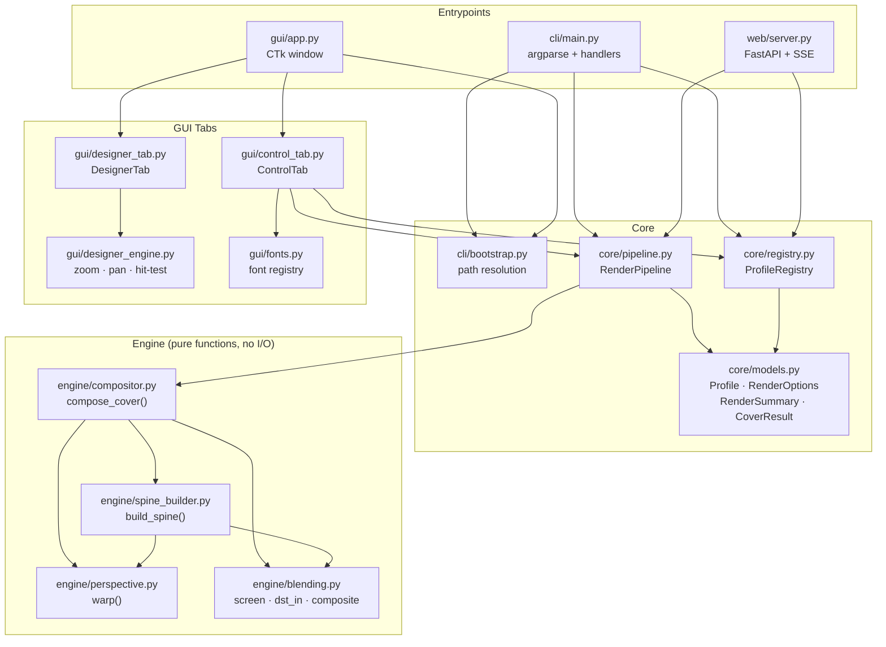

---

## 2. Fluxo CLI — Comando `render`

Sequência completa desde o terminal até o arquivo salvo em disco.

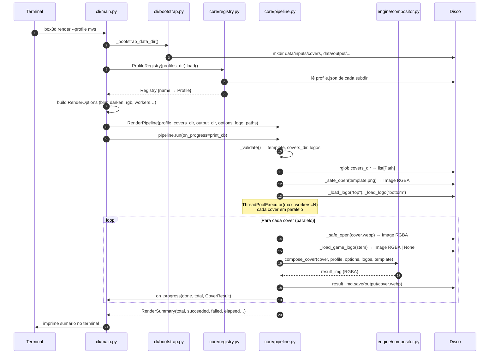

---

## 3. Pipeline Internos — Controle de Fluxo

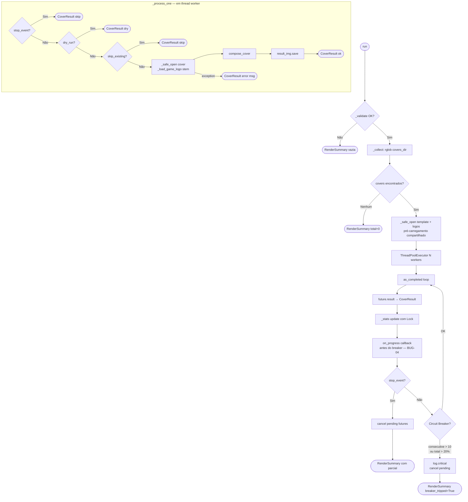

---

## 4. Engine — Pipeline de Composição por Cover

`compose_cover()` é o único ponto de entrada no engine. Orquestra 5 etapas sequenciais, todas em memória (PIL Images RGBA).

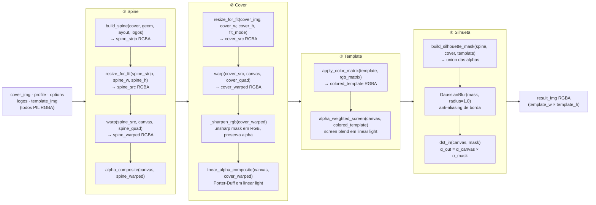

---

## 5. Spine Builder — Construção da Lombada

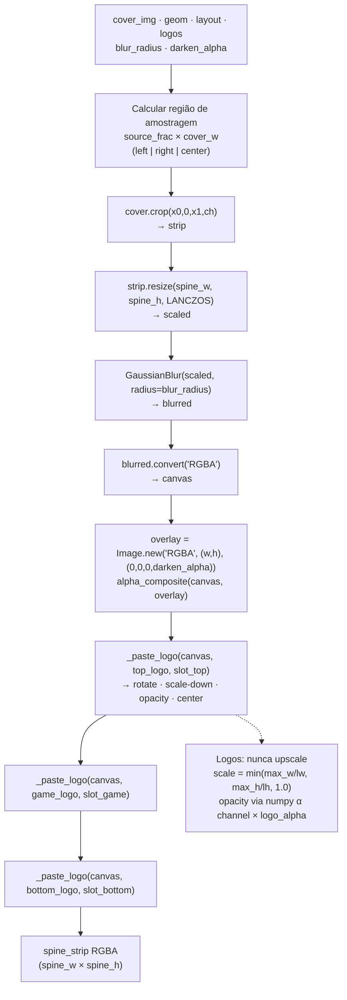

---

## 6. Perspective Warp — Dual Backend

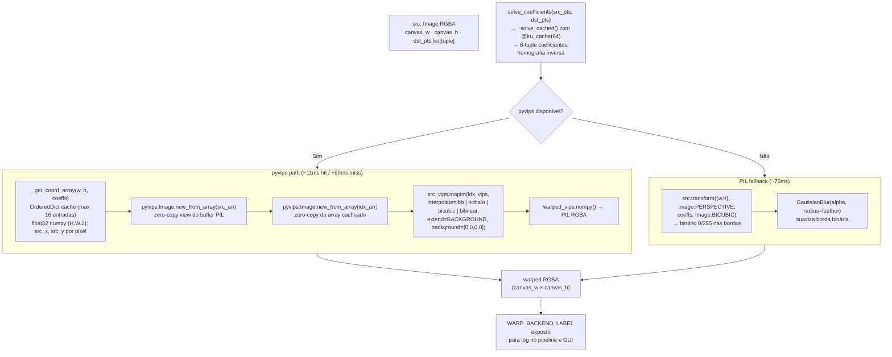

---

## 7. Fluxo GUI — Desktop

### 7a. Inicialização

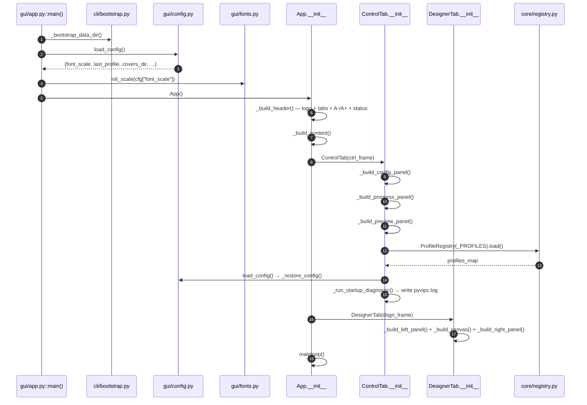

### 7b. Fluxo de Render no GUI

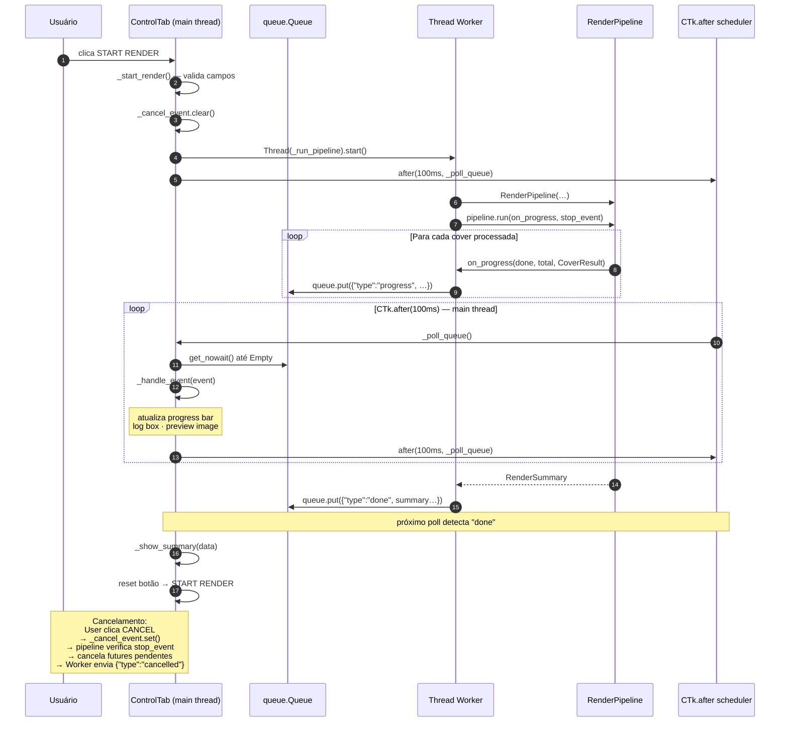

### 7c. Escala de Fonte — Live Update

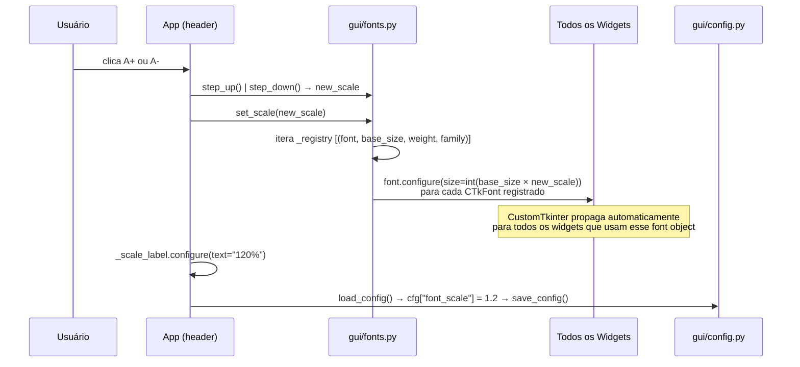

---

## 8. Fluxo Web Server — SSE Render

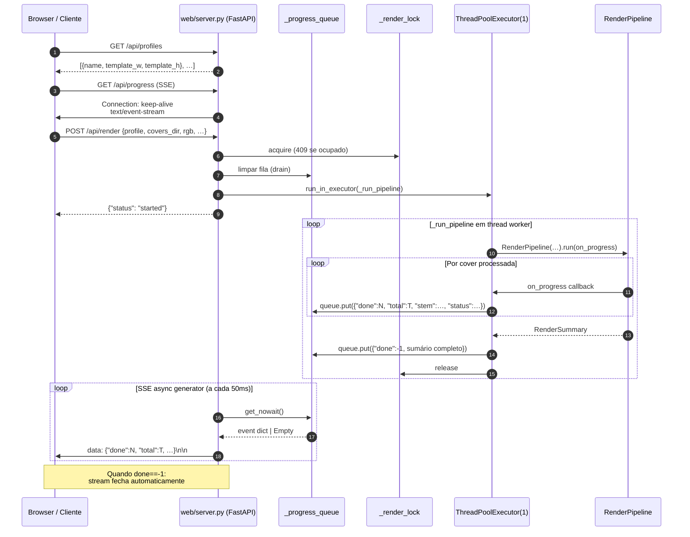

---

## 9. Modelo de Dados — Tipos e Transformações

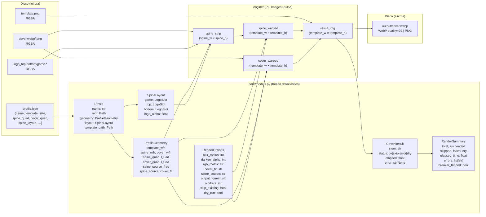

---

## 10. Mapa de I/O e Threading

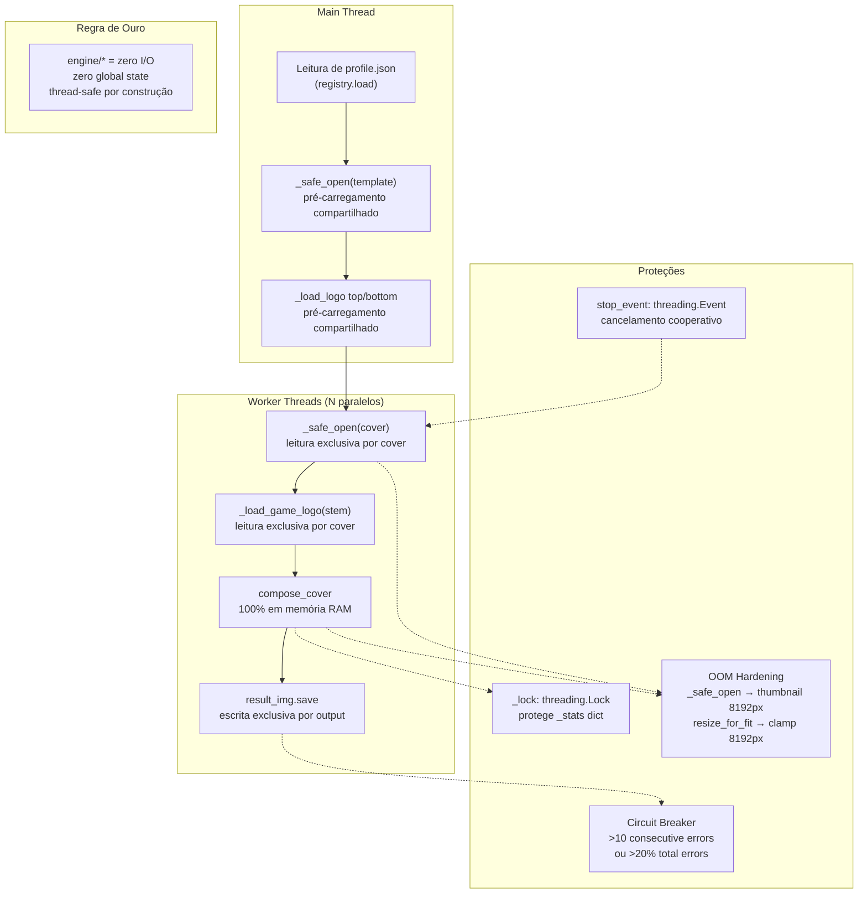

---

## 11. Bootstrap e Resolução de Paths

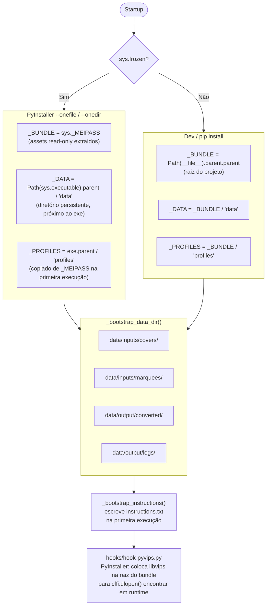

---

## Resumo — Princípios de Design

| Princípio | Onde | Como |
|---|---|---|
| **I/O exclusivo no pipeline** | `core/pipeline.py` | engine/* não tem acesso a disco |
| **Engine pure functions** | `engine/*` | sem estado global, thread-safe por construção |
| **OOM Hardening** | `_safe_open()` + `resize_for_fit()` | clamp 8192px em duas camadas independentes |
| **Circuit Breaker** | `pipeline.run()` | aborta batch com >10 erros consecutivos ou >20% |
| **Cancelamento cooperativo** | `threading.Event` | verificado em `_process_one` antes de cada cover |
| **on_progress antes do breaker** | `pipeline.run()` | o item que dispara o breaker é sempre reportado (BUG-04) |
| **Imutabilidade** | `core/models.py` | `@dataclass(frozen=True)` em todos os tipos de domínio |
| **Path traversal protection** | `core/registry.py` | `^[a-zA-Z0-9_-]+$` antes de qualquer acesso a disco |
| **Fonte live-scalable** | `gui/fonts.py` | `CTkFont.configure()` via registry centralizado |
| **Simplicity first** | todos os módulos | solução canônica preferida; complexidade só quando necessária |
