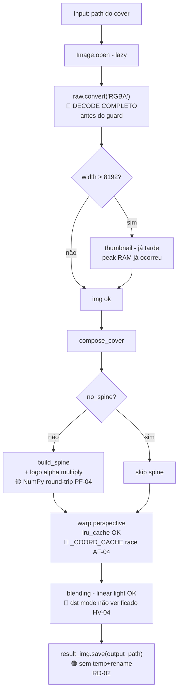
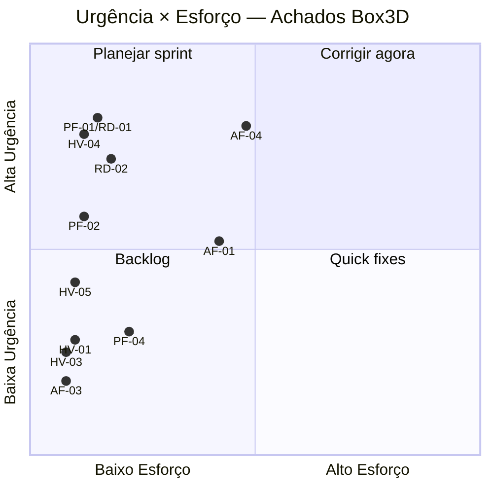

# BOX3D-AUDIT — Auditoria Profunda

> **Sistema:** Box3D v3.0.7RC — Gerador de arte 3D para capas de jogos
> **Tipo:** Auditoria de profundidade — vícios ocultos, falhas arquiteturais, performance, desvios
> **Data:** 2026-06-17
> **Commit auditado:** `be7a69a`
> **Sprints de referência:** SPRINT-CORE-REFACTOR-01 · SPRINT-PERF-BATCH-01
> **Work orders:** TASK-BUGFIX-01 · TASK-CLI-EXTRACT-01 · TASK-ENGINE-IO-PURGE-01

---

## DASHBOARD

```
┌────────────────────────────────────────────────────────────────┐
│  BOX3D AUDIT SUMMARY                                           │
├────────────────────────────────────────────────────────────────┤
│  🔴 Vícios críticos:        2  (HV-04, AF-04)                  │
│  🟠 Falhas arquiteturais:   4  (AF-01 a AF-04)                 │
│  🟡 Problemas performance:  3  (PF-01, PF-02, PF-04)          │
│  🔵 Desvios de regra:       2  (RD-01, RD-02)                  │
│  🟣 Gaps de teste:          8  críticos                        │
├────────────────────────────────────────────────────────────────┤
│  Camada mais problemática:  core/pipeline.py + engine/         │
│  Vício mais grave:          AF-04 — race condition em cache    │
│  Quick win mais alto:       RD-01 — 2 linhas, elimina OOM peak │
│  Regra mais violada:        Lei de Ferro (decode antes do guard)│
└────────────────────────────────────────────────────────────────┘
```

---

## VÍCIOS OCULTOS

---

### [HV-01] — GUI swallows template thumbnail errors silently

**Categoria:** Falha silenciosa
**Severidade:** 🟡 Médio
**Arquivo:** `gui/control_tab.py:518`

**O que foi encontrado:**
```python
try:
    img     = Image.open(path).convert("RGBA")
    img.thumbnail((256, 160), Image.LANCZOS)
    ...
except Exception:
    pass
```

**Por que é perigoso para o Box3D:**
`MemoryError`, `OSError`, `PIL.UnidentifiedImageError` e qualquer outra exceção são descartadas silenciosamente. O usuário vê o painel de preview sem imagem e não sabe se o template está corrompido, se falta permissão de leitura, ou se houve OOM. Como o `Image.open()` é feito sem context manager aqui, um `MemoryError` pode ainda vazar o file handle.

**Como se manifesta:**
Template corrompido ou inacessível → UI exibe painel vazio sem mensagem de erro. Usuário clica em Render com template inválido → o batch falha no pipeline com erro menos claro.

**Correção:**
```python
except Exception as exc:
    log.warning("Template thumbnail failed for %s: %s", path, exc)
    # optionally set label to error state
```

---

### [HV-02] — `gui/config.py` descarta silenciosamente falhas de disco

**Categoria:** Falha silenciosa
**Severidade:** 🟡 Médio (GUI only)
**Arquivo:** `gui/config.py:25`

**O que foi encontrado:**
```python
def save_config(data: dict) -> None:
    try:
        _CONFIG_PATH.write_text(...)
    except Exception:
        pass
```

**Por que é perigoso:**
Disco cheio ou diretório sem permissão de escrita → configurações do usuário não são persistidas. Na próxima sessão tudo reseta. Zero feedback.

**Correção:**
```python
except Exception as exc:
    log.warning("Config save failed (%s): %s", _CONFIG_PATH, exc)
```

---

### [HV-03] — `cli/utils.py:parse_rgb_str` captura exceções demais

**Categoria:** Falha silenciosa — swallowing de bugs de programação
**Severidade:** 🟡 Médio
**Arquivo:** `cli/utils.py:39`

**O que foi encontrado:**
```python
except Exception:
    return None
```

**Por que é perigoso:**
Qualquer `NameError`, `AttributeError` ou `TypeError` introduzido numa refutura refatoração do `parse_rgb_str` retorna `None` silenciosamente, fazendo a matriz RGB ser ignorada. O caller em `cmd_render()` só verifica `if args.rgb and not rgb_matrix` — a falha se torna invisível.

**Correção:**
```python
except ValueError:
    return None
```
Apenas `ValueError` é semanticamente esperado ao converter strings para float.

---

### [HV-04] — `engine/blending.py`: sem asserção de modo `"RGBA"` em `dst` 🔴

**Categoria:** Assunção de modo PIL não verificada
**Severidade:** 🔴 Crítico (latente — `IndexError` se qualquer caller passar RGB)
**Arquivo:** `engine/blending.py:107` (`alpha_weighted_screen`), `engine/blending.py:148` (`linear_alpha_composite`)

**O que foi encontrado:**
```python
def alpha_weighted_screen(dst: Image.Image, src: Image.Image) -> Image.Image:
    dst_arr = np.array(dst, dtype=np.uint8)      # ← sem verificação de modo
    src_arr = np.array(src.convert("RGBA"), ...)  # src é guardado
    ...
    result[:, :, 3] = np.maximum(dst_arr[:, :, 3], src_arr[:, :, 3])
    #                                         ^ IndexError se dst for RGB (shape H,W,3)
```

Contraste com `build_silhouette_mask` que tem a asserção correta:
```python
assert all(src.mode == "RGBA" for src in alpha_sources), \
    "build_silhouette_mask: all sources must be RGBA"
```

**Por que é perigoso para o Box3D:**
Os callers atuais passam `canvas` (sempre RGBA). Mas se algum caller futuro passar o `template` antes do `convert("RGBA")`, ou se um profile carregar um template RGB em vez de RGBA, a função explode com `IndexError: index 3 is out of bounds for axis 2 with size 3`. A engine não tem context manager para essa falha — ela se propaga até `_process_one` como um erro genérico, difícil de diagnosticar.

**Como se manifesta:**
`IndexError` no worker thread → cover logada como erro → nenhuma indicação da causa raiz.

**Correção:**
Adicionar ao início de cada função, seguindo o padrão de `build_silhouette_mask`:
```python
assert dst.mode == "RGBA", f"dst must be RGBA, got {dst.mode!r}"
```

---

### [HV-05] — `engine/perspective.py`: `except Exception` no import do pyvips

**Categoria:** Captura de exceções além do esperado
**Severidade:** 🟡 Médio
**Arquivo:** `engine/perspective.py:72`

**O que foi encontrado:**
```python
except Exception:
    _pyvips = None
    _PYVIPS_AVAILABLE = False
```

**Por que é perigoso:**
Captura `SystemExit`, `MemoryError`, e qualquer exception inesperada de um finalizer nativo. Mais praticamente: se pyvips está instalado mas `libvips.so.42` não está no `LD_LIBRARY_PATH`, a falha `OSError` é capturada mas o log apenas diz "pyvips not available" sem o motivo real. O usuário não sabe que a biblioteca está instalada mas inacessível.

**Correção:**
```python
except (ImportError, OSError, AttributeError) as exc:
    log.info("pyvips not available (%s: %s) — falling back to PIL BICUBIC warp",
             type(exc).__name__, exc)
    _pyvips = None
    _PYVIPS_AVAILABLE = False
```

---

## FALHAS ARQUITETURAIS

---

### [AF-01] — `engine/perspective.py` lê `os.environ` no import-time

**Tipo:** Engine layer com dependência de estado de processo
**Regra violada:** TASK-ENGINE-IO-PURGE-01 — "engine sem I/O de sistema"
**Arquivo:** `engine/perspective.py:56,88`

**Evidência:**
```python
import os                                                      # linha 56
_VIPS_KERNEL: str = os.environ.get("BOX3D_WARP_BACKEND", "lbb")  # linha 88
```

**Impacto arquitetural:**
1. `BOX3D_WARP_BACKEND` é lido uma única vez no import — testes que definem `os.environ["BOX3D_WARP_BACKEND"]` em tempo de execução não têm efeito.
2. O `warp_kernel` já é passado por parâmetro via `RenderOptions.warp_kernel` — a env var é uma configuração redundante e um canal oculto.
3. Acopla a engine ao ambiente de processo, violando o contrato de "função pura".

**Correção:**
Remover a leitura de `os.environ` da engine. O `_VIPS_KERNEL` pode ser mantido como constante `"lbb"` (o default) e o kernel de execução é sempre passado via parâmetro `kernel=` (já acontece).

---

### [AF-02] — Engine modules importam `logging`

**Tipo:** Engine com efeito colateral externo (INV-04 backlog documentado)
**Regra violada:** TASK-ENGINE-IO-PURGE-01 (parcial — efeito colateral, não I/O de disco)
**Arquivo:** `engine/compositor.py:14`, `engine/perspective.py:55`, `engine/spine_builder.py:17`

**Evidência:**
```python
import logging
log = logging.getLogger("box3d.compositor")  # módulo-level logger = global state
```

**Impacto arquitetural:**
Um logger de módulo é estado global. Em produção, `logging` é threadsafe (GIL protege a handler chain), então não há risco de corrida. Mas qualquer teste que queira validar que a engine não tem efeitos colaterais falhará. Já classificado como débito técnico no RC2-GATE.md (INV-04).

**Prioridade:** Baixa — impacto atual zero. Backlog v3.1.

---

### [AF-03] — `engine/compositor.py` tem `import dataclasses` dentro de funções

**Tipo:** Import runtime em hot path
**Arquivo:** `engine/compositor.py:180,190`

**Evidência:**
```python
def _effective_geometry(profile: Profile, options: RenderOptions):
    import dataclasses           # ← executado a cada render
    geom = profile.geometry
    ...

def _effective_layout(profile: Profile, options: RenderOptions):
    import dataclasses           # ← executado a cada render
    layout = profile.layout
```

**Impacto:**
Após o primeiro import, `sys.modules["dataclasses"]` resolve o import em ~100 ns (dict lookup). Negligível em si, mas demonstra inconsistência: `dataclasses` deveria estar nos imports de topo do módulo. Rompe o contrato de "função pura" (uma função que importa tem um efeito colateral de inicialização).

**Correção:**
Mover `import dataclasses` para o topo de `engine/compositor.py`.

---

### [AF-04] — `_COORD_CACHE` em `engine/perspective.py`: operação composta não atômica 🔴

**Tipo:** Race condition em cache global compartilhado por threads
**Arquivo:** `engine/perspective.py:125, 208–222`

**Evidência:**
```python
_COORD_CACHE: OrderedDict[tuple, np.ndarray] = OrderedDict()  # linha 125

def _get_coord_array(...):                                      # linha 194
    if key in _COORD_CACHE:
        _COORD_CACHE.move_to_end(key)   # step 1 — não atômico com step 2
        return _COORD_CACHE[key]         # step 2 — race: key pode ter sido evicted
    ...
    _COORD_CACHE[key] = arr             # step 3
    if len(_COORD_CACHE) > _COORD_CACHE_MAX:
        _COORD_CACHE.popitem(last=False) # step 4 — pode evict key recém-inserida
    return _COORD_CACHE[key]             # step 5 — KeyError se step 4 evicted key!
```

O comentário no código afirma: "Python's GIL serialises the check-and-insert." Isso é verdade para bytecodes individuais mas não para a sequência multi-bytecode `check → move_to_end → read`.

**Cenário de falha concreto:**
- Cache com exatamente 16 entradas (limite), todas para perfis diferentes.
- Thread A: executa `_COORD_CACHE[key] = arr` (step 3) para key K.
- Thread B: contexto switch logo antes do `popitem` de Thread A.
- Thread B: insere seu próprio `key = K2`, executa `popitem()` que evicts K (mais antigo).
- Thread A: retoma, executa seu `popitem()` evictando K2, então `return _COORD_CACHE[K]` → `KeyError` porque B evictou K.

**Quando acontece:**
Web server mode com 4+ workers renderizando perfis diferentes simultaneamente e o cache está cheio (≥16 geometrias únicas). Probabilidade baixa por render mas não zero em batches longos.

**Impacto:**
`KeyError` não capturado em `_warp_pyvips` → cover logada como erro. Sem corrupção de dados, mas falha intermitente difícil de rastrear.

**Correção:**
```python
import threading
_COORD_CACHE_LOCK = threading.Lock()

def _get_coord_array(...) -> np.ndarray:
    with _COORD_CACHE_LOCK:
        if key in _COORD_CACHE:
            _COORD_CACHE.move_to_end(key)
            return _COORD_CACHE[key]
    
    arr = _compute_coord_array(...)   # cálculo fora do lock (puro)
    
    with _COORD_CACHE_LOCK:
        _COORD_CACHE[key] = arr
        if len(_COORD_CACHE) > _COORD_CACHE_MAX:
            _COORD_CACHE.popitem(last=False)
        return _COORD_CACHE[key]
```

---

## PROBLEMAS REAIS DE PERFORMANCE

---

### [PF-01] — `_safe_open` decodifica imagem completa antes do guard de 8192px

**Tipo:** OOM peak desnecessário — decode completo antes da proteção
**Impacto estimado:** +256 MB de RAM peak para input 9000×9000; inalterado para inputs ≤8192px
**Arquivo:** `core/pipeline.py:48–53`

**Código atual:**
```python
with Image.open(path) as raw:
    img = raw.convert("RGBA")      # ← force-decode TOTAL: 9000×9000×4 = 324 MB
if img.width > 8192 or img.height > 8192:
    img.thumbnail((8192, 8192), Image.BICUBIC)  # ← thumbnail após o pico
```

**Por que é lento/perigoso:**
`Image.open()` é lazy (lê apenas o header). `raw.convert("RGBA")` força o decode completo para RAM. Para um scan de 9000×9000 JPEG, isso aloca ~324 MB antes do `thumbnail()` poder reduzir. Em máquinas com 2 GB de RAM rodando 4 workers paralelos, isso representa ~1.3 GB apenas de peaks de decode.

JPEG e WEBP possuem subsampling nativo que PIL usa via `thumbnail()` sobre o objeto lazy — o decode ocorre em resolução reduzida, evitando o peak.

**Implementação eficiente:**
```python
with Image.open(path) as raw:
    if raw.width > 8192 or raw.height > 8192:
        log.warning("OOM Hardening: downscaling %s (%dx%d → ≤8192px)",
                    path.name, raw.width, raw.height)
        raw.thumbnail((8192, 8192), Image.BICUBIC)  # subsampling nativo (JPEG/WEBP)
    img = raw.convert("RGBA")
```

**Ganho estimado:** Para inputs ≤8192px (caso típico): zero. Para inputs oversized: reduz RAM peak de 324 MB para ~200 MB (exemplo 9000×9000). Importante para sistemas com RAM limitada em batch paralelo.

---

### [PF-02] — Ausência de `Image.MAX_IMAGE_PIXELS` explícito

**Tipo:** Comportamento inconsistente para inputs muito grandes
**Arquivo:** `core/pipeline.py:48` (nenhum override antes da chamada)

**Situação atual:**
- PIL default: `MAX_IMAGE_PIXELS = 89,478,485` (~9459×9459 px)
- Nossa regra: 8192×8192 = 67,108,864 px
- Input entre 67M–89M px (ex: 9000×9000): handled pelo nosso `thumbnail()`.
- Input acima de 89M px (ex: 10000×10000 = 100M px): PIL lança `DecompressionBombError` antes do nosso código rodar → arquivo logado como erro com mensagem confusa para o usuário.

**Fix:**
```python
# Em core/pipeline.py, antes de _safe_open:
Image.MAX_IMAGE_PIXELS = None  # desabilita proteção do PIL; nossa Lei de Ferro é o único gate
```
Combinado com PF-01, isso garante que qualquer input — por maior que seja — é transparentemente downscalado para ≤8192px sem erro para o usuário.

---

### [PF-04] — `engine/spine_builder.py`: round-trip NumPy para aplicar alpha em logo

**Tipo:** Conversão PIL→NumPy→PIL desnecessária
**Impacto estimado:** ~0.3 ms por logo × 3 logos × N covers (batch de 1000: ~0.9 s extra)
**Arquivo:** `engine/spine_builder.py:181–183`

**Código atual:**
```python
arr = np.array(logo, dtype=np.float32)         # PIL → float32 NumPy (full copy)
arr[:, :, 3] = np.clip(arr[:, :, 3] * alpha, 0, 255)
logo = Image.fromarray(arr.astype(np.uint8), "RGBA")  # NumPy → PIL (full copy)
```

**Por que é ineficiente:**
Duas cópias completas de array para uma simples multiplicação de canal alpha. PIL tem suporte nativo via `point()` que opera em C puro sem cópia intermediária.

**Implementação eficiente:**
```python
r, g, b, a = logo.split()
a = a.point(lambda v: round(v * alpha))   # LUT C-puro, zero round-trips NumPy
logo = Image.merge("RGBA", (r, g, b, a))
```

**Ganho estimado:** ~0.3 ms por logo, ~0.9 s por batch de 1000 covers com 3 logos cada.

---

## DESVIOS DE REGRAS ESTABELECIDAS

---

### [RD-01] — Lei de Ferro: guard de 8192px aplicado DEPOIS do decode completo

**Regra:** "OOM Hardening — asset carregado sem verificação de tamanho"
**Origem:** SPRINT-CORE-REFACTOR-01
**Arquivo:** `core/pipeline.py:48–53`

**Desvio encontrado:**
```python
with Image.open(path) as raw:
    img = raw.convert("RGBA")   # ← DECODE COMPLETO aqui
if img.width > 8192 or img.height > 8192:  # ← guard aqui — tarde demais
    img.thumbnail(...)
```

**O que a regra exige:**
O guard deve ser aplicado ANTES de decodificar os pixels. O objeto lazy retornado por `Image.open()` tem `.width` e `.height` disponíveis a custo zero (header-only). A thumbnail deve ser aplicada sobre o objeto lazy.

**Risco se não corrigido:**
Input 9000×9000 aloca 324 MB antes de ser reduzido. Em batch com 4 workers, peak teórico de ~1.3 GB apenas para decode de inputs oversized. Em sistemas cloud com 1 GB de RAM, isso causa OOM kill do processo antes do guard proteger.

**Correção:** ver PF-01.

---

### [RD-02] — Atomic Delivery: output escrito diretamente sem temp+rename

**Regra:** Atomic Delivery — SPRINT-CORE-REFACTOR-01
**Arquivo:** `core/pipeline.py:334–336`

**Desvio encontrado:**
```python
result_img.save(str(output_path), "WEBP", quality=95, method=4)
# ou
result_img.save(str(output_path), "PNG", optimize=False)
```

**O que a regra exige:**
Arquivo temporário + rename atômico. Em POSIX, `os.replace(tmp, final)` é atômico a nível de inode.

**Risco se não corrigido:**
Um SIGKILL ou queda de energia durante o encode de um arquivo WebP de 8 MB (encode ~0.5 s) deixa um arquivo parcial e corrompido em `output_path`. Com `--skip-existing`, a execução seguinte pula o arquivo → o usuário recebe silenciosamente uma imagem corrompida na pasta de output.

**Sem `--skip-existing`** (default): o arquivo corrompido é sobrescrito na próxima run, então o cenário é auto-corrigido. O risco real é específico para usuários que usam `--skip-existing` em retomadas de batch.

**Correção:**
```python
tmp_path = output_path.with_suffix(".tmp")
try:
    if ext == ".webp":
        result_img.save(str(tmp_path), "WEBP", quality=95, method=4)
    else:
        result_img.save(str(tmp_path), "PNG", optimize=False)
    tmp_path.replace(output_path)   # POSIX-atomic rename
except Exception:
    tmp_path.unlink(missing_ok=True)
    raise
```

---

## GAPS DE COBERTURA DE TESTES

| Módulo | Função/Comportamento | Risco |
|--------|---------------------|-------|
| `engine/blending.py` | `alpha_weighted_screen` com `dst` RGB | 🔴 `IndexError` se caller futuro passa RGB |
| `engine/blending.py` | `linear_alpha_composite` com `dst` RGB | 🔴 Mesmo que acima |
| `engine/perspective.py` | `_get_coord_array` com 16+ geometrias simultâneas (race) | 🔴 `KeyError` intermitente em web server mode |
| `core/pipeline.py` | `_safe_open` com input >89M px (`DecompressionBombError`) | 🟠 Erro confuso para usuário com scan grande |
| `core/pipeline.py` | `_safe_open` com input >8192px (ordering: decode-before-thumbnail) | 🟠 OOM peak sem teste que o detecte |
| `core/pipeline.py` | Falha de escrita com `--skip-existing` no retry (arquivo parcial) | 🟠 Corrupção silenciosa |
| `engine/compositor.py` | `_effective_geometry` com override de `spine_source`/`cover_fit` aplicado | 🟡 Override pode estar sendo silenciosamente ignorado |
| `web/server.py` | `GET /api/preview/{filename}` com path traversal (`../secret`) | 🟡 Proteção existe (`Path(filename).name`) mas sem teste |
| `web/server.py` | `GET /api/version` | 🟢 Trivial — ausência de teste notável |
| `cli/main.py` | `_workers_type("auto")` quando `os.cpu_count()` retorna `None` | 🟡 `TypeError` em sistema incomum |
| `engine/spine_builder.py` | Spine com todos os logos `None` (background only) | 🟢 Provável que funcione, mas não testado explicitamente |
| `core/pipeline.py` | `stop_event` acionado durante processamento (cancel mid-batch) | 🟡 Lógica de cancel coberta apenas indiretamente |

---

## ANÁLISE DO PIPELINE DE RENDERIZAÇÃO



**Anotações por nó:**
- **CONV** (🔴): Faz decode completo antes do guard de 8192px — PF-01/RD-01. Fix: `raw.thumbnail()` antes de `raw.convert()`.
- **WARP** (🔴): `_COORD_CACHE` tem race condition em operação composta — AF-04. Fix: lock em torno da operação composta.
- **BLEND** (🔴): `dst` assumido RGBA sem asserção — HV-04. Fix: `assert dst.mode == "RGBA"`.
- **SAVE** (🟠): Escrita direta sem atomicidade — RD-02. Fix: temp+rename.
- **BS** (🟡): Round-trip NumPy desnecessário para alpha de logo — PF-04. Fix: `PIL.point()`.

---

## MAPA DE PRIORIZAÇÃO



---

## PLANO DE CORREÇÃO

| Fase | Achados | Critério de conclusão | Esforço |
|------|---------|----------------------|---------|
| 1 — Quick wins (≤5 linhas cada) | HV-03, HV-04, HV-05, AF-03 | Zero bare-except fora de contexto; asserções dst em blending | P |
| 2 — Lei de Ferro correta | PF-01 / RD-01, PF-02 | `thumbnail()` antes de `convert()` em `_safe_open`; `MAX_IMAGE_PIXELS=None` | P |
| 3 — Atomic Delivery | RD-02 | temp+rename em `_process_one` | P |
| 4 — Cache race | AF-04 | Lock em `_get_coord_array`; teste de concorrência com 17 geometrias | M |
| 5 — Engine I/O cleanup | AF-01, AF-02 | `os.environ` removido da engine; logging optional | M |
| 6 — Performance spine | PF-04 | `PIL.point()` substituindo round-trip NumPy; benchmark | P |
| 7 — Testes gaps críticos | HV-04 path, AF-04 race, RD-02 partial | Cobertura dos 3 cenários críticos com novos testes | M |

---

## ACHADOS POSITIVOS (O QUE ESTÁ BEM)

O codebase é genuinamente bem-engenheirado nos seguintes pontos:

1. **Circuit breaker ordenado corretamente (BUG-04):** `on_progress` é chamado *antes* da avaliação do breaker em `pipeline.py:235-236`, exatamente como o CLAUDE.md mandata.

2. **`lru_cache` na homografia:** `_solve_cached` envolve listas mutáveis em tuplas imutáveis antes de cachear — a chave de cache é corretamente estável.

3. **Batch thread-safe:** `RenderPipeline._lock` guarda corretamente o dict `_stats`. `stop_event` é `threading.Event`, não bool mutável.

4. **Blending em espaço linear:** todas as operações de cor (Screen blend, Porter-Duff over) corretamente linearizam sRGB antes da aritmética via LUT `_to_linear`/`_to_srgb_f32`.

5. **Asserções RGBA nas fronteiras públicas da engine:** `compose_cover` valida `cover_img.mode == "RGBA"` e `template_img.mode == "RGBA"` — fail-fast em input inválido.

6. **Proteção contra path traversal:** `^[a-zA-Z0-9_-]+$` em `registry.py` + `Path(filename).name` em `web/server.py:390` para preview.

7. **Zero I/O de disco na engine:** confirmado por varredura completa — nenhum `open()`, `write()`, `read()`, `Path()` em `engine/*.py`.

8. **Sem loops Python sobre pixels:** toda a aritmética de imagem usa operações NumPy vetorizadas — `np.maximum`, `np.clip`, broadcasting, `_to_linear` via LUT.

9. **OOM em duas camadas independentes:** validação de geometria em `core/models.py:__post_init__` + downscaling em `_safe_open` — defense-in-depth, mesmo com o ordering issue do PF-01.

---

## APPENDIX — ARQUIVOS AUDITADOS

| Camada | Arquivo | Linhas |
|--------|---------|--------|
| Engine | `engine/blending.py` | 230 |
| Engine | `engine/perspective.py` | 370 |
| Engine | `engine/spine_builder.py` | 200 |
| Engine | `engine/compositor.py` | 191 |
| Core | `core/pipeline.py` | 377 |
| Core | `core/models.py` | 230 |
| Core | `core/registry.py` | ~150 |
| CLI | `cli/main.py` | 411 |
| CLI | `cli/utils.py` | ~45 |
| CLI | `cli/diagnostics.py` | 216 |
| CLI | `cli/bootstrap.py` | ~80 |
| Web | `web/server.py` | ~380 |
| GUI | `gui/control_tab.py` | ~1100 |
| GUI | `gui/config.py` | ~30 |
| Tests | `tests/test_v2.py` | 1970+ |
| Tests | `tests/test_web.py` | ~200 |
