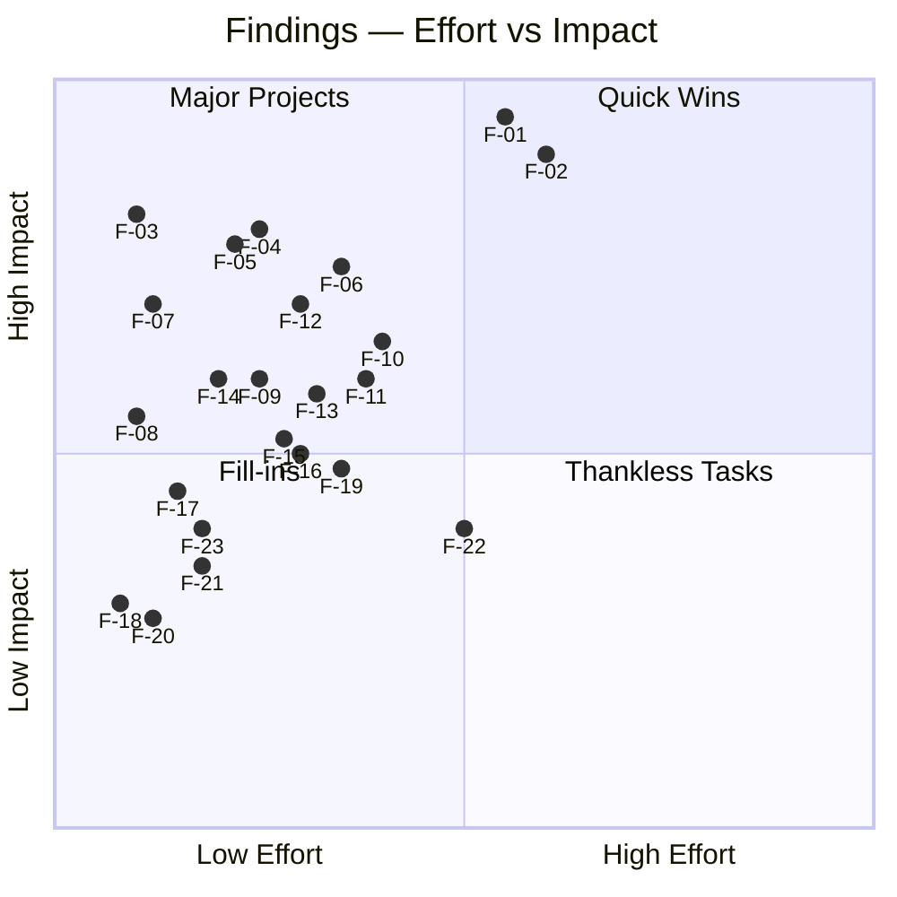

# EXPERT-REPORT.md — box3d v3.0.0RC

**Reviewer:** Automated Expert Analysis  
**Date:** 2026-06-12  
**Scope:** UX Engineering · Implementation Quality  
**Files analyzed:** 17 files, ~6,017 lines  

---

## Executive Diagnosis

box3d v3.0.0RC demonstrates genuinely strong architectural discipline. The three-tier layered model (cli → core → engine) is consistently enforced: engine modules contain zero I/O, pipeline.py is the sole disk boundary, and all intermediate images stay in RAM. The security posture around profile loading is solid — path-traversal mitigation via regex, OOM hardening at two independent layers, and frozen dataclasses for domain models prevent the most common classes of memory and injection vulnerabilities. The circuit breaker in pipeline.py is well-designed and its tests are preserved through good documentation hygiene.

The weak points cluster in three areas. First, the codebase has a persistent version drift problem: the CLI help text advertises v2.0.0, the web UI shows v2.1.0, and bootstrap.py declares v3.0.0RC. This creates immediate credibility damage on first contact with any surface of the product. Second, the web server carries an architectural flaw that will produce silent data corruption under any non-trivial concurrent usage: a single module-level `queue.Queue` and `_last_output_dir` global state are shared across all HTTP sessions, making two simultaneous renders race destructively. Third, the cancellation mechanism in the GUI uses exception injection into a thread pool callback — raising `InterruptedError` inside `on_progress` — which is a misuse of the cancellation pattern and produces undefined behavior when the ThreadPoolExecutor ignores the exception and continues dispatching futures.

Across all three UX surfaces (CLI, web UI, desktop GUI), error messaging is generally good but several gaps remain: blur-radius has no maximum bound at the CLI layer, cover_fit has no pattern validation at the web API layer, the RGB matrix has no upper-bound validation at the web API layer, and the GUI validation of Workers/Blur/Darken conflates all three errors into a single generic message. Minor accessibility omissions include no keyboard focus management in the web summary modal and the web UI's version badge being static markup rather than API-sourced truth.

The overall quality is above average for a rendering tool of this scope. The issues that exist are real but bounded: no finding here represents an unfixable design flaw. All can be resolved with targeted patches.

---

## Findings Summary Table

| # | Severity | Domain | Location | Title |
|---|----------|--------|----------|-------|
| F-01 | 🔴 Critical | Implementation | `web/server.py:70-71` | Global queue + last_output_dir races under concurrent renders |
| F-02 | 🔴 Critical | Implementation | `gui/control_tab.py:699-700` | Cancellation via InterruptedError injection into thread pool callback |
| F-03 | 🟠 High | UX | `cli/main.py:50`, `web/ui/index.html:24`, `cli/bootstrap.py:139` | Three different version strings across three surfaces |
| F-04 | 🟠 High | Implementation | `web/server.py:217-220` | RGB matrix upper-bound not validated; unbounded float amplification accepted |
| F-05 | 🟠 High | Implementation | `web/server.py:86,227` | cover_fit field lacks enum/pattern validation at Pydantic model level |
| F-06 | 🟠 High | Implementation | `core/pipeline.py:241` | Circuit breaker consecutive_errors counter not protected by lock |
| F-07 | 🟠 High | Implementation | `core/pipeline.py:48` | `_safe_open` never closes the file handle (PIL lazy-load file leak) |
| F-08 | 🟡 Medium | UX | `cli/main.py:81,201` | `--blur-radius` has no upper-bound validation (CLI accepts arbitrarily large values) |
| F-09 | 🟡 Medium | UX | `gui/control_tab.py:632-637` | Workers/Blur/Darken validation emits one generic error for three distinct problems |
| F-10 | 🟡 Medium | Implementation | `web/server.py:113-114` | `_get_registry()` re-scans disk on every API call — no caching |
| F-11 | 🟡 Medium | Implementation | `engine/perspective.py:93,176-182` | `_COORD_CACHE` grows without bound; no eviction policy |
| F-12 | 🟡 Medium | Security | `web/server.py:57-62` | CORS wildcard `allow_origins=["*"]` — inappropriate for file-system-exposing server |
| F-13 | 🟡 Medium | UX | `web/ui/app.js:327-334` | SSE `onerror` fires on every keep-alive gap; false "connection lost" messages |
| F-14 | 🟡 Medium | UX | `web/ui/index.html:24` | Version badge is hardcoded markup; will drift from server reality |
| F-15 | 🟡 Medium | Implementation | `core/models.py:124,134` | `SpineLayout` and `Profile` are mutable dataclasses; design inconsistency |
| F-16 | 🟡 Medium | UX | `gui/designer_tab.py:425` | Spine layout default rotation hardcoded to `-90` in UI; not sourced from profile defaults |
| F-17 | 🔵 Low | UX | `cli/main.py:347-359` | No-command fallback silently launches web server without user consent |
| F-18 | 🔵 Low | Implementation | `cli/utils.py:25` | `parse_rgb_str` double-logs one user error across two modules |
| F-19 | 🔵 Low | UX | `web/ui/app.js:406-447` | Summary modal has no keyboard trap (WCAG 2.2 §2.1.2) |
| F-20 | 🔵 Low | Implementation | `core/pipeline.py:345-348` | `_validate()` warns on missing marquees_dir that is the valid default |
| F-21 | 🔵 Low | UX | `gui/control_tab.py:624-628` | Output directory emptiness check occurs after directory creation — reversed order |
| F-22 | 🔵 Low | Implementation | `web/server.py:291` | `asyncio.to_thread` wraps a function that spawns a `ThreadPoolExecutor` |
| F-23 | 🔵 Low | UX | `engine/perspective.py:86` | `BOX3D_WARP_BACKEND` accepts any string; invalid values crash at runtime |

---

## Detailed Findings

### F-01 — Global Queue and last_output_dir Race Under Concurrent Renders

**Severity:** 🔴 Critical  
**Domain:** Implementation  
**Location:** `web/server.py:70-71`

**Issue:** `_progress_queue` and `_last_output_dir` are module-level globals shared across all HTTP requests. If two clients simultaneously POST to `/api/render`, their progress events will be interleaved in a single queue and drained by both SSE streams, each client seeing the other's progress. `_last_output_dir` will be overwritten by whichever render starts last, causing `/api/preview` and `/api/open-folder` to serve the wrong directory.

**Evidence:**
```python
# web/server.py:70-71
_progress_queue: queue.Queue[dict] = queue.Queue()
_last_output_dir: Path | None = None   # set by _run_pipeline; read by /api/open-folder
```

The drain loop attempts cleanup but is itself a race window: events from an in-flight render can be drained by the next render's startup, losing progress events permanently.

**Recommendation:** Add a module-level `_render_lock = asyncio.Lock()` and acquire it in `start_render` before dispatching the background task. Return HTTP 409 Conflict if the lock is held. Alternatively, key the queue and output_dir on a session/job UUID returned in the `{"status": "started"}` response.

---

### F-02 — Cancellation via InterruptedError Injection into Thread Pool Callback

**Severity:** 🔴 Critical  
**Domain:** Implementation  
**Location:** `gui/control_tab.py:699-700`

**Issue:** The GUI render cancellation raises `InterruptedError` inside `on_progress`, which is called from within the `as_completed` loop in `RenderPipeline.run()`. The `ThreadPoolExecutor` does not stop running futures when an exception propagates from the loop body — only the loop itself is interrupted. Futures already submitted continue executing in the background thread pool. The pipeline's `_stats` dict and `_lock` then receive updates from threads that have no caller to report to. When the next render starts, leftover state from the previous run can corrupt counts.

**Evidence:**
```python
# gui/control_tab.py:699-700
if self._cancel_event.is_set():
    raise InterruptedError("Render cancelado pelo usuário.")
```
```python
# core/pipeline.py:218-251
for future in as_completed(futures):
    result: CoverResult = future.result()
    # ...
    if on_progress is not None:
        on_progress(done, total, result)  # ← InterruptedError raised here
    # ← loop body exits, but pool threads continue
```

**Recommendation:** Pass a `threading.Event stop_event` parameter to `RenderPipeline.run()`. In `_process_one`, check `stop_event.is_set()` before beginning each cover and return a `CoverResult(status="skip")`. The main loop can then call `pool.shutdown(wait=False, cancel_futures=True)` (Python 3.9+) when stop is requested.

---

### F-03 — Three Different Version Strings Across Three Surfaces

**Severity:** 🟠 High  
**Domain:** UX  
**Location:** `cli/main.py:50`, `web/ui/index.html:24`, `cli/bootstrap.py:139`

**Issue:** The product presents three different version numbers depending on which surface the user is interacting with. The CLI help text says v2.0.0, the web UI header says v2.1.0, and the bootstrap module declares v3.0.0RC. A user referencing the version for a bug report is given contradictory information.

**Evidence:**
```python
# cli/main.py:50
description="box3d — Arcade game 3D box art generator (v2.0.0)",
```
```html
<!-- web/ui/index.html:24 -->
<span class="version">v2.1.0</span>
```
```python
# cli/bootstrap.py:139
_VERSION = "3.0.0RC"
```

**Recommendation:** Define `__version__ = "3.0.0RC"` in a single canonical location (e.g., `core/version.py`). Import it in `cli/main.py` and serve it from a `/api/version` endpoint. Fetch it from the API in `app.js` on boot and inject it into the DOM.

---

### F-04 — RGB Matrix Upper Bound Not Validated at Web API Layer

**Severity:** 🟠 High  
**Domain:** Implementation  
**Location:** `web/server.py:217-220`

**Issue:** The web API accepts `rgb_matrix` as `list[float]` with `min_length=3, max_length=3` but applies no upper bound to individual channel values. The check at line 219 only guards against negative values. A client can submit `[100.0, 100.0, 100.0]`, which produces entirely blown-out output. The GUI sliders are clamped to 5.0, but this constraint is not propagated to the backend.

**Evidence:**
```python
# web/server.py:217-220
if payload.rgb_matrix and len(payload.rgb_matrix) == 3:
    r, g, b = payload.rgb_matrix
    if r >= 0 and g >= 0 and b >= 0:
        rgb_matrix_str = f"{r} 0 0  0 {g} 0  0 0 {b}"
```

**Recommendation:** Add `le=5.0` per-element validation. In Pydantic v2: `Annotated[list[Annotated[float, Field(ge=0.0, le=5.0)]], Field(min_length=3, max_length=3)]`. Also add the upper-bound check to `cli/utils.py:parse_rgb_str`.

---

### F-05 — `cover_fit` Field Lacks Enum Validation at Pydantic Level

**Severity:** 🟠 High  
**Domain:** Implementation  
**Location:** `web/server.py:86,227`

**Issue:** `cover_fit` is declared as `str | None` with only a human-readable description `"stretch | fit | crop"`. There is no `pattern` or `Literal` type constraint. An invalid value like `"tile"` passes Pydantic validation, flows through to `RenderOptions`, and reaches `resize_for_fit()` which silently defaults to the crop path via an unguarded `else` branch.

**Evidence:**
```python
# web/server.py:86
cover_fit:    str | None = Field(None, description="stretch | fit | crop")
```

**Recommendation:** Change the type to `Literal["stretch", "fit", "crop"] | None`. The same applies to `output_format` at line 92 — it also lacks a `Literal["webp", "png"]` constraint.

---

### F-06 — Circuit Breaker `total_errors` Read Outside Lock

**Severity:** 🟠 High  
**Domain:** Implementation  
**Location:** `core/pipeline.py:241`

**Issue:** `total_errors` is read from `self._stats` at line 239 outside the `with self._lock:` block that guards all writes to `_stats`. The asymmetry between what is and is not lock-guarded is a maintenance hazard: a future refactor that parallelises the progress callback could introduce a read/write race on the stats dict.

**Evidence:**
```python
# core/pipeline.py:239-242
total_errors = self._stats.get("error", 0)   # read outside lock

if consecutive_errors > _CB_MAX_CONSECUTIVE or \
   total_errors > error_threshold:
```

**Recommendation:** Hoist the `total_errors` read inside the existing `with self._lock:` block at line 221, storing the snapshot for use below. This eliminates the inconsistency window and makes the locking intent explicit.

---

### F-07 — `_safe_open` Never Closes PIL File Handle (Lazy-Load File Leak)

**Severity:** 🟠 High  
**Domain:** Implementation  
**Location:** `core/pipeline.py:48`

**Issue:** `Image.open()` in Pillow uses lazy loading: the file descriptor is kept open until image data is fully accessed. While `convert()` forces a full decode, the underlying file object from `Image.open()` is not explicitly closed. On Windows, open file handles prevent the source file from being renamed, moved, or deleted during a batch run. In a large batch, this may exhaust the OS file descriptor limit before GC collects the handles.

**Evidence:**
```python
# core/pipeline.py:48
img = Image.open(path).convert("RGBA")
```

**Recommendation:** Use a context manager:
```python
with Image.open(path) as raw:
    img = raw.convert("RGBA")
```
This is the pattern recommended in Pillow's own documentation.

---

### F-08 — `--blur-radius` Has No Upper Bound at CLI Layer

**Severity:** 🟡 Medium  
**Domain:** UX  
**Location:** `cli/main.py:81,201`

**Issue:** The CLI argument `--blur-radius` is accepted as any non-negative integer. The web UI caps blur at 100 and the GUI slider goes to 50, but the CLI validator only checks `>= 0`. A user passing `--blur-radius 5000` will cause Pillow's `GaussianBlur` to allocate a kernel of radius 5000 pixels, consuming enormous memory and CPU time with no user warning.

**Evidence:**
```python
# cli/main.py:81
render_p.add_argument("--blur-radius", "-b", type=int, default=20,
                      help="Spine background blur radius (>= 0)")
# cli/main.py:201
if args.blur_radius < 0:
    log.error("--blur-radius %d must be >= 0.", args.blur_radius)
    return 1
```

**Recommendation:** Add `if args.blur_radius > 100: log.error(...); return 1` at line 201. Define a shared constant `BLUR_MAX = 100` referenced by CLI, Pydantic model, and GUI.

---

### F-09 — GUI Numeric Field Validation Emits One Generic Error for Three Distinct Problems

**Severity:** 🟡 Medium  
**Domain:** UX  
**Location:** `gui/control_tab.py:632-637`

**Issue:** The `except ValueError` block catches parsing failures from Workers, Blur, and Darken simultaneously and shows a single error dialog: "Workers must be an integer or 'auto'." If the user entered invalid text in Darken or Blur, this message is misleading. Nielsen Heuristic 9 (Help users recognize, diagnose, and recover from errors) requires that error messages identify the exact field and value.

**Evidence:**
```python
# gui/control_tab.py:632-637
try:
    workers_raw = self._workers_var.get().strip()
    workers = os.cpu_count() or 1 if workers_raw == "auto" else int(workers_raw or 4)
    blur    = int(self._blur_var.get()    or 20)
    darken  = int(self._darken_var.get()  or 180)
except ValueError:
    messagebox.showerror("Error", "Workers must be an integer or 'auto'.")
    return
```

**Recommendation:** Parse each field independently with individual try/except blocks and field-specific error messages. Also add range validation: `if not (0 <= darken <= 255)` and `if not (0 <= blur <= 100)`.

---

### F-10 — `/api/profiles` Re-Scans Disk on Every API Call

**Severity:** 🟡 Medium  
**Domain:** Implementation  
**Location:** `web/server.py:113-114`

**Issue:** `_get_registry()` constructs a new `ProfileRegistry` and calls `.load()` on every invocation. `/api/profiles` is called on page load and potentially on every profile selector refresh. `ProfileRegistry.load()` calls `sorted(self._dir.iterdir())`, reads every `profile.json` from disk, and parses JSON on each call. With many profiles or a slow filesystem (NFS, spinning disk), this is an unnecessary latency source.

**Evidence:**
```python
# web/server.py:113-114
def _get_registry() -> ProfileRegistry:
    return ProfileRegistry(str(_PROFILES)).load()
```

**Recommendation:** Cache the registry at module level as `_registry: ProfileRegistry | None = None`. Reload lazily on first call and expose a `POST /api/profiles/reload` endpoint for explicit refresh. Use a file-mtime check on the `profiles/` directory to detect when profiles change.

---

### F-11 — `_COORD_CACHE` Grows Without Bound

**Severity:** 🟡 Medium  
**Domain:** Implementation  
**Location:** `engine/perspective.py:93,176-182`

**Issue:** `_COORD_CACHE` is a module-level dictionary that accumulates one `(H, W, 2)` float32 numpy array per unique `(canvas_w, canvas_h, coeffs)` triple. For a typical 700×1000 template, each entry is ~5.6 MB. With a long-lived web server process rendering multiple profiles, the cache grows unboundedly. The `_solve_cached` `lru_cache` is capped at `maxsize=64`, but `_COORD_CACHE` has no cap.

**Evidence:**
```python
# engine/perspective.py:93
_COORD_CACHE: dict[tuple, np.ndarray] = {}

# engine/perspective.py:176-182
if key not in _COORD_CACHE:
    _COORD_CACHE[key] = np.stack([src_x, src_y], axis=2)
return _COORD_CACHE[key]
```

**Recommendation:** Replace the plain dict with an `lru_cache`-backed function, or cap the dict at a fixed size (e.g., 8 entries ≈ 45 MB) and evict the least-recently-used entry when the limit is reached.

---

### F-12 — CORS Wildcard Inappropriate for Filesystem-Accessing Server

**Severity:** 🟡 Medium  
**Domain:** Security  
**Location:** `web/server.py:57-62`

**Issue:** `allow_origins=["*"]` allows any web page to make cross-origin requests to the local Box3D server. Since the server exposes endpoints like `/api/render` (filesystem reads), `/api/open-folder` (launches OS file manager), and `/api/validate-path` (reveals filesystem structure), a malicious web page could silently trigger renders or probe local paths simply by being opened in the same browser.

**Evidence:**
```python
# web/server.py:57-62
app.add_middleware(
    CORSMiddleware,
    allow_origins=["*"],
    allow_methods=["*"],
    allow_headers=["*"],
)
```

**Recommendation:** Restrict to `allow_origins=["http://127.0.0.1:8000", "http://localhost:8000"]` by default, with an `--allow-origins` CLI flag for users who explicitly want broader access.

---

### F-13 — SSE `onerror` Fires on Keep-Alive Gaps; False "Connection Lost" Messages

**Severity:** 🟡 Medium  
**Domain:** UX  
**Location:** `web/ui/app.js:327-334`

**Issue:** The `EventSource.onerror` handler unconditionally displays "✘ Connection to server lost" and closes the stream. SSE's `onerror` fires on any network hiccup including normal keep-alive timeouts. Closing the stream in `onerror` prevents the browser's automatic reconnection from happening, terminating the progress stream prematurely even when the server is still running.

**Evidence:**
```javascript
// web/ui/app.js:327-334
_evtSource.onerror = () => {
  if (_evtSource) {
    _appendLog('✘ Connection to server lost.');
    _evtSource.close();
    _evtSource = null;
    _setRendering(false);
  }
};
```

**Recommendation:** Check `_evtSource.readyState === EventSource.CLOSED` (true disconnect) vs `EventSource.CONNECTING` (transient; browser is retrying). Only close and show the error on `CLOSED`. Add an exponential-backoff retry counter before surfacing the message.

---

### F-14 — Web UI Version Badge is Hardcoded Markup

**Severity:** 🟡 Medium  
**Domain:** UX  
**Location:** `web/ui/index.html:24`

**Issue:** The version label `v2.1.0` is static HTML that does not match the actual version declared anywhere else in the codebase. Even if F-03 is resolved by unifying versions, a static HTML string will always lag releases.

**Evidence:**
```html
<!-- web/ui/index.html:24 -->
<span class="version">v2.1.0</span>
```

**Recommendation:** Add a `GET /api/version` endpoint returning `{"version": "3.0.0RC"}`. In `app.js`, fetch this on boot and update the DOM. This also serves as a health-check endpoint.

---

### F-15 — `SpineLayout` and `Profile` Are Mutable Dataclasses; Design Inconsistency

**Severity:** 🟡 Medium  
**Domain:** Implementation  
**Location:** `core/models.py:124,134`

**Issue:** The CLAUDE.md design principle states "All dataclasses use `@dataclass(frozen=True)`." `ProfileGeometry`, `Quad`, `Rect`, and `LogoSlot` correctly use `frozen=True`. But `SpineLayout` and `Profile` are plain mutable `@dataclass`, meaning `profile.layout.logo_alpha = 0.0` would silently affect all subsequent renders without any error.

**Evidence:**
```python
# core/models.py:124
@dataclass       # ← missing frozen=True
class SpineLayout:
    game:   LogoSlot
    top:    LogoSlot
    bottom: LogoSlot
    logo_alpha: float = 0.85

# core/models.py:134
@dataclass       # ← missing frozen=True
class Profile:
```

**Recommendation:** Add `frozen=True` to `SpineLayout` and `Profile`. The `_effective_layout` and `_effective_geometry` helpers in `compositor.py` already use `dataclasses.replace()` correctly, so this change requires no call-site updates.

---

### F-16 — Spine Layout Default Rotation Hardcoded to `-90` in Designer UI

**Severity:** 🟡 Medium  
**Domain:** UX  
**Location:** `gui/designer_tab.py:425`

**Issue:** The spine slot defaults in the Designer UI hardcode `rotate` to `-90` for all three slots. This diverges from the profile JSON schema defaults (`0` per `LogoSlot` definition). A user importing an existing profile with `"rotate": 0` and re-exporting will find their rotation values replaced by `-90`, silently breaking the profile. The import fallback at line 697 also defaults to `-90`.

**Evidence:**
```python
# gui/designer_tab.py:425
defaults = {"game": ("80","320","500","-90"), "top": ("80","120","160","-90"), "bottom": ("80","80","840","-90")}
```

**Recommendation:** Change UI defaults and the import fallback to `0` to match `LogoSlot.rotate`'s default. If `-90` is the intended box3d convention, document and apply it consistently at the profile-schema level.

---

### F-17 — No-Command Fallback Silently Launches Web Server

**Severity:** 🔵 Low  
**Domain:** UX  
**Location:** `cli/main.py:347-359`

**Issue:** Running `box3d` with no arguments silently launches the web server if the `[web]` extra is installed. This violates Nielsen Heuristic 1 (Visibility of System Status): the binary appears to hang until the user discovers a server is running on port 8000. The `log.info` message is only visible at INFO level and may not appear if logging is not configured.

**Evidence:**
```python
# cli/main.py:347-359
if getattr(args, "command", None) is None:
    try:
        import uvicorn
        from web.server import app
    except ImportError:
        parser.print_help()
        sys.exit(0)
    log.info("No command given — launching web server on http://127.0.0.1:8000")
    uvicorn.run(app, host="127.0.0.1", port=8000, reload=False)
```

**Recommendation:** Print a notice to stdout before starting uvicorn, independent of logging configuration: `print("Starting web server at http://127.0.0.1:8000 — press Ctrl+C to stop")`.

---

### F-18 — `parse_rgb_str` Double-Logs One User Error Across Two Modules

**Severity:** 🔵 Low  
**Domain:** Implementation  
**Location:** `cli/utils.py:25`

**Issue:** When an invalid RGB string is provided, `parse_rgb_str` calls `log.warning` and returns `None`, then the caller in `cli/main.py` calls `log.error` — producing two separate log entries for a single user error. The function's dual-logging behavior is also not reflected in its docstring.

**Evidence:**
```python
# cli/utils.py
except Exception as exc:
    log.warning("parse_rgb_str: %r — %s — ignored", rgb_str, exc)
    return None
```
```python
# cli/main.py:205-208
rgb_matrix = parse_rgb_str(args.rgb) if args.rgb else None
if args.rgb and not rgb_matrix:
    log.error("Invalid RGB matrix format: %s", args.rgb)
    return 1
```

**Recommendation:** Remove the `log.warning` from `parse_rgb_str` and consolidate error reporting at the call site. This makes `parse_rgb_str` a pure converter with no side effects.

---

### F-19 — Summary Modal Has No Keyboard Trap (WCAG 2.2 §2.1.2)

**Severity:** 🔵 Low  
**Domain:** UX  
**Location:** `web/ui/app.js:406-447`

**Issue:** When the summary modal appears after a render, focus is not moved into it and Tab keystrokes continue to cycle through the background form controls. WCAG 2.2 Success Criterion 2.1.2 (No Keyboard Trap) requires that keyboard focus be contained within modal dialogs while they are open.

**Evidence:** `_showSummary()` in `app.js` sets `summaryOverlay.classList.remove('hidden')` but does not call `summaryModal.focus()` or install a Tab-key listener to trap focus.

**Recommendation:** On modal open, call `btnCloseModal.focus()`. Add a `keydown` listener on the overlay that intercepts `Tab`/`Shift+Tab` to cycle focus only among the modal's interactive elements (`btnOpenOutput` and `btnCloseModal`). Remove the listener on close.

---

### F-20 — `_validate()` Warns on Missing Marquees Dir That Is Already the Valid Default

**Severity:** 🔵 Low  
**Domain:** Implementation  
**Location:** `core/pipeline.py:345-348`

**Issue:** `_validate()` logs a warning if `self.marquees_dir` is set but the directory does not exist. However, the pipeline constructor defaults `marquees_dir` to `profile.root / "assets"` when none is provided. For profiles without an `assets/` directory, this warning fires on every single render, filling logs with noise about a condition that is entirely normal.

**Evidence:**
```python
# core/pipeline.py:345-348
if self.marquees_dir and not self.marquees_dir.is_dir():
    log.warning("Marquees directory not found: %s — no game logos", self.marquees_dir)
```

**Recommendation:** Only warn when the user explicitly provided a `marquees_dir` path. Introduce a `_user_provided_marquees_dir: bool` flag on the pipeline to distinguish explicit vs. default.

---

### F-21 — Output Directory Emptiness Check Occurs After Directory Creation

**Severity:** 🔵 Low  
**Domain:** UX  
**Location:** `gui/control_tab.py:624-628`

**Issue:** The GUI `_start_render` method constructs `output_dir = Path(self._output_var.get().strip())` and later calls `output_dir.mkdir(parents=True, exist_ok=True)` before the emptiness check `if not self._output_var.get().strip()`. The check can never trigger because `Path("").mkdir(...)` would have already raised an exception or created a directory in the current working directory.

**Evidence:**
```python
# gui/control_tab.py — logical order (reconstructed):
output_dir = Path(self._output_var.get().strip())
if not covers_dir.is_dir(): ...  return
if not self._output_var.get().strip(): ...  return   # ← too late
output_dir.mkdir(parents=True, exist_ok=True)        # ← executes before the empty check
```

**Recommendation:** Move the empty-string check for `output_dir` before constructing `Path(...)` and before the `mkdir` call.

---

### F-22 — `asyncio.to_thread` Wraps a Function That Spawns a `ThreadPoolExecutor`

**Severity:** 🔵 Low  
**Domain:** Implementation  
**Location:** `web/server.py:291`

**Issue:** `asyncio.to_thread(_run_pipeline)` blocks a single thread from asyncio's default thread pool for the entire duration of a render (potentially minutes). Inside `_run_pipeline`, `RenderPipeline.run()` spawns its own `ThreadPoolExecutor`. This blocks the asyncio thread pool worker indefinitely, which can starve other `asyncio.to_thread()` calls in future code paths.

**Evidence:**
```python
# web/server.py:291
background_tasks.add_task(asyncio.to_thread, _run_pipeline)
```

**Recommendation:** Use `loop.run_in_executor(None, _run_pipeline)` or a dedicated single-thread `ThreadPoolExecutor` reserved for render jobs. This also makes future cancellation support easier.

---

### F-23 — `BOX3D_WARP_BACKEND` Accepts Any String; Invalid Values Crash at Runtime

**Severity:** 🔵 Low  
**Domain:** UX  
**Location:** `engine/perspective.py:86`

**Issue:** The environment variable `BOX3D_WARP_BACKEND` is read at module import time and passed directly to `pyvips.Interpolate.new()`. If the user sets it to an invalid kernel name, the error surfaces as a pyvips exception deep in the render of the first cover, not at startup. For a frozen executable, this is particularly confusing because the stack trace is not visible.

**Evidence:**
```python
# engine/perspective.py:86
_VIPS_KERNEL: str = os.environ.get("BOX3D_WARP_BACKEND", "lbb")
```

**Recommendation:** Validate `_VIPS_KERNEL` against the known set `{"lbb", "nohalo", "bicubic", "bilinear"}` at module import time and raise a clear `ValueError` with the list of valid values if an unknown kernel is provided.

---

## Priority Matrix



---

## Treatment Track

```mermaid
flowchart TD
    Start([Begin remediation]) --> P1

    subgraph P1["Priority 1 — Correctness (1–3 days)"]
        F01["F-01: Add render mutex\n(web/server.py)"]
        F02["F-02: Replace InterruptedError\ncancellation with stop_event\n(pipeline.py + control_tab.py)"]
        F07["F-07: Wrap Image.open\nin context manager\n(pipeline.py:48)"]
    end

    P1 --> P2

    subgraph P2["Priority 2 — Validation Gaps (1–2 days)"]
        F04["F-04: Add rgb_matrix\nupper-bound validation\n(server.py + utils.py)"]
        F05["F-05: Add Literal type\nfor cover_fit/output_format\n(server.py:86)"]
        F06["F-06: Snapshot stats inside lock\n(pipeline.py:239)"]
        F08["F-08: Add blur-radius\nmax bound at CLI\n(main.py:201)"]
    end

    P2 --> P3

    subgraph P3["Priority 3 — UX Polish (<1 day each)"]
        F03["F-03: Unify version string\n(all surfaces)"]
        F09["F-09: Per-field validation\nerrors in GUI\n(control_tab.py:636)"]
        F12["F-12: Restrict CORS origins\n(server.py:59)"]
        F13["F-13: Fix SSE onerror\nhandler logic\n(app.js:327)"]
    end

    P3 --> P4

    subgraph P4["Priority 4 — Maintenance Quality"]
        F10["F-10: Cache registry in server"]
        F11["F-11: Cap _COORD_CACHE\n(perspective.py:93)"]
        F14["F-14: Source version from API\n(index.html:24)"]
        F15["F-15: Freeze SpineLayout/Profile\n(models.py:124)"]
        F16["F-16: Fix designer rotation defaults\n(designer_tab.py:425)"]
        F17["F-17: Print startup notice\n(main.py:357)"]
        F19["F-19: Add modal focus trap\n(app.js)"]
        F20["F-20: Guard marquees warning\n(pipeline.py:347)"]
        F21["F-21: Fix validation order\n(control_tab.py:624)"]
        F22["F-22: Dedicated executor\n(server.py:291)"]
        F23["F-23: Validate BOX3D_WARP_BACKEND\n(perspective.py:86)"]
        F18["F-18: Clean parse_rgb_str\nlogging\n(utils.py:25)"]
    end

    P4 --> Done([Done])
```



---

## Self-Assessment

- [x] Every finding has a specific file:line citation
- [x] Every finding has a code snippet or observable evidence
- [x] Every finding has a concrete recommendation
- [x] Priority matrix covers all findings
- [x] Executive diagnosis reflects the findings
