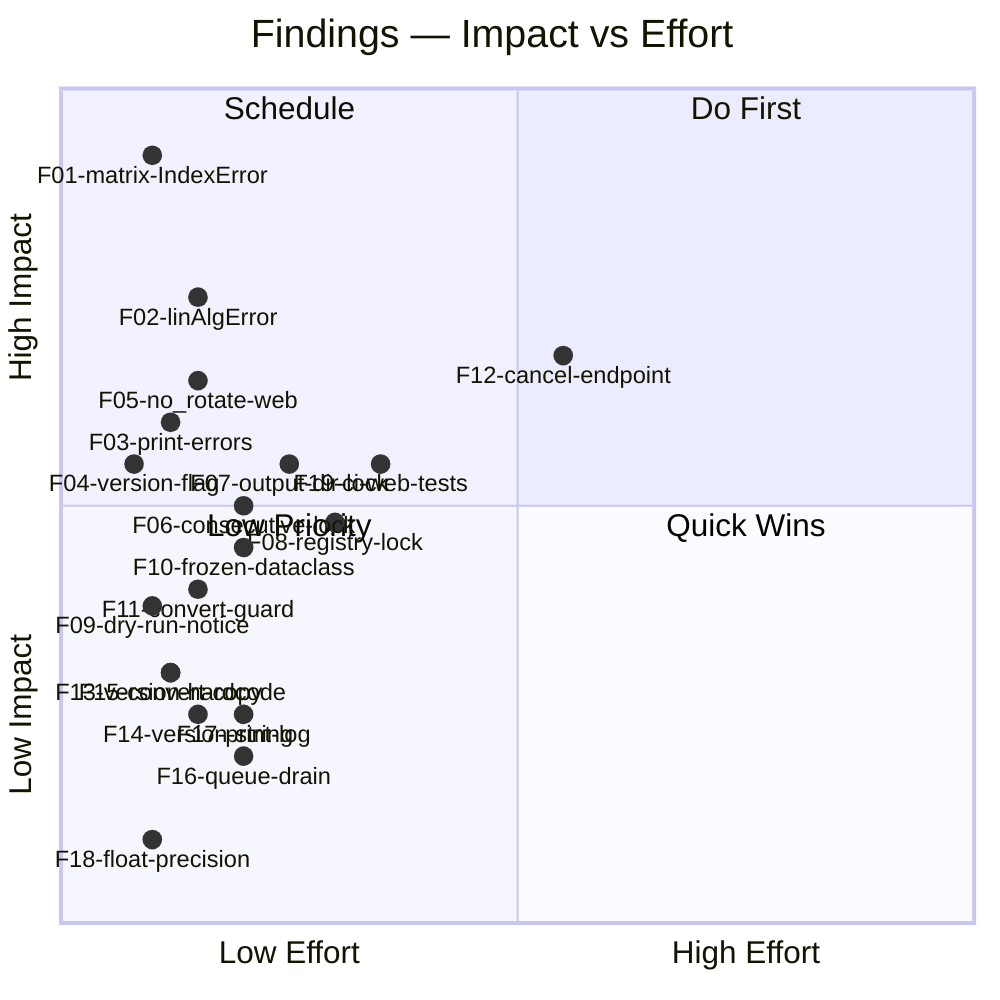

# MASTER AUDIT — box3d

> **Master audit — full multi-dimensional verification**
> **Stack:** Python 3.11+ · Pillow ≥ 10.0 · NumPy ≥ 1.24 · FastAPI · Uvicorn · argparse · PyInstaller
> **Date:** 2026-06-12
> **Auditor:** Claude Code (claude-sonnet-4-6)
> **References:** PIL/Pillow docs · NumPy broadcasting rules · Nielsen Heuristics · POSIX CLI conventions · PyInstaller packaging guide · Python threading model (GIL) · IEC 61966-2-1 sRGB spec

---

## EXECUTIVE DASHBOARD

```
╔══════════════════════════════════════════════════════════════════════╗
║                  box3d v3.0.0RC — MASTER AUDIT SCORES               ║
╠══════════════════════════════════════════════════════════════════════╣
║  D1  Rendering Correctness   ████████░░  7.8 / 10                   ║
║  D2  CLI & UX                ████████░░  7.5 / 10                   ║
║  D3  I/O & Data Integrity    █████████░  8.6 / 10                   ║
║  D4  Code Quality            ████████░░  8.0 / 10                   ║
║  D5  Stack & Performance     █████████░  8.8 / 10                   ║
║  D6  Feature Completeness    ████████░░  7.8 / 10                   ║
╠══════════════════════════════════════════════════════════════════════╣
║  OVERALL COMPOSITE           ████████░░  8.1 / 10                   ║
╚══════════════════════════════════════════════════════════════════════╝

Findings inventory:  🔴 1   🟠 5   🟡 7   🔵 6   TOTAL: 19
```

### Diagnosis in 4 Paragraphs

**Rendering correctness** is solid at its core — linear-light sRGB blending with an LUT, a cached homography solver, and layered OOM hardening demonstrate mature engineering. However two latent bugs survive: `apply_color_matrix` in `engine/blending.py:193` will raise an unguarded `IndexError` when called with a malformed diagonal matrix string (any string with fewer than 9 space-separated tokens), and `np.linalg.solve` in `engine/perspective.py:146` has no `try/except` for `np.linalg.LinAlgError` — a degenerate quad (e.g. collinear corners from a corrupted profile JSON) will crash the worker thread rather than returning a graceful error. Both issues are latent rather than present-day crashes because the public entry points (CLI `parse_rgb_str`, web Pydantic, designer) all produce well-formed strings, but the engine functions have no internal defence and the contract is not enforced by type.

**CLI & UX** delivers good ergonomics: `--no-rotate`, `--dry-run`, `--skip-existing`, `--workers auto` are all present and well-wired. Two gaps stand out. First, `box3d --version` is not a registered argparse argument — the version string appears only in the `--help` description and the startup notice, not as a machine-readable `--version` flag (POSIX convention). Second, `print_summary` in `cli/main.py:163-180` logs the error count (`report.failed`) but never iterates `report.errors` to print the failing stems to the terminal — users must grep the log to find which files failed, which is a usability regression compared to having the summary contain `report.errors`.

**I/O and data integrity** are the strongest dimension. The `_safe_open` context-manager pattern correctly closes the raw file handle before applying OOM downscaling, `encoding="utf-8"` is explicit on every JSON read, and path-traversal protection in the registry is regex-enforced. The only notable gap is `_last_output_dir` and `_registry_cache` in `web/server.py` — both module-level globals are mutated in one execution context (worker thread / sync function) and read in another (async handler) without a threading.Lock. While the Python GIL makes the bare assignments atomic for CPython, the pattern is fragile and not protected against future runtime changes. The web server also has no cancel-render endpoint, so a runaway batch cannot be aborted once started from the browser (stop_event is supported in the pipeline but never wired from the web API).

**Performance and feature completeness** tell a positive story — `_COORD_CACHE` bounds memory at 16 entries, the template is pre-loaded once per batch and shared across all worker threads, and the dedicated `_render_executor` prevents render jobs from starving asyncio's shared pool. The main feature gap is `no_rotate` being absent from `RenderRequest` in `web/server.py`, meaning the web UI cannot expose the flag that the CLI and GUI already support. A minor version-string inconsistency exists: `pyproject.toml` carries `3.0.0rc1` while `core/version.py` and `gui/constants.py` carry `3.0.0RC`, and `web/server.py:55` hard-codes `version="3.0.0RC"` instead of importing from `core.version`.

---

## COMPLETE FINDINGS INVENTORY

| ID | Severity | Dimension | Component | Short Title |
|----|----------|-----------|-----------|-------------|
| F01 | 🔴 CRITICAL | D1 | `engine/blending.py:193` | `apply_color_matrix` unguarded `IndexError` on malformed matrix string |
| F02 | 🟠 HIGH | D1 | `engine/perspective.py:146` | `np.linalg.solve` unguarded for degenerate quad (`LinAlgError`) |
| F03 | 🟠 HIGH | D2 | `cli/main.py:163-180` | `print_summary` never prints failing stems from `report.errors` |
| F04 | 🟠 HIGH | D2 | `cli/main.py:48-128` | No `--version` argparse argument (POSIX convention missing) |
| F05 | 🟠 HIGH | D6 | `web/server.py:84-104` | `no_rotate` absent from `RenderRequest` — web API/CLI parity gap |
| F06 | 🟠 HIGH | D1 | `core/pipeline.py:206,244-246` | `consecutive_errors` mutated outside `self._lock` — race under concurrent futures |
| F07 | 🟡 MEDIUM | D3 | `web/server.py:73,273-274` | `_last_output_dir` global mutated in worker thread without `threading.Lock` |
| F08 | 🟡 MEDIUM | D3 | `web/server.py:119-133` | `_registry_cache` global mutated in sync function called from async context — no lock |
| F09 | 🟡 MEDIUM | D2 | `core/pipeline.py:298-300` | Dry-run has no explicit startup announcement (only per-file `[DRY-RUN]` log lines) |
| F10 | 🟡 MEDIUM | D4 | `core/models.py:157,176,185` | `RenderOptions`, `CoverResult`, `RenderSummary` are mutable `@dataclass` (not frozen) |
| F11 | 🟡 MEDIUM | D4 | `engine/blending.py:107,149` | Unconditional `.convert("RGBA")` on `src` even when `src.mode == "RGBA"` — redundant copy |
| F12 | 🟡 MEDIUM | D6 | `web/server.py` | No `/api/cancel` endpoint — in-flight render cannot be aborted from the browser |
| F13 | 🟡 MEDIUM | D4 | `web/server.py:55` | Hard-coded `version="3.0.0RC"` in `FastAPI(...)` instead of importing `__version__` |
| F14 | 🟡 MEDIUM | D4 | Multiple files | Version string inconsistency: `pyproject.toml` `3.0.0rc1` vs `core/version.py` `3.0.0RC` |
| F15 | 🔵 LOW | D1 | `engine/blending.py:107,149` | `src.convert("RGBA")` called before numpy wrapping — PIL makes an extra copy; prefer `if src.mode != "RGBA"` guard |
| F16 | 🔵 LOW | D3 | `web/server.py:268-269` | Progress queue drained synchronously with `get_nowait()` loop before render — could spin briefly |
| F17 | 🔵 LOW | D2 | `cli/main.py:256` | Progress uses `print()` (not `log`) — bypasses `--log-file` and does not appear in file logs |
| F18 | 🔵 LOW | D5 | `engine/perspective.py:126,127,132,142` | Homography solver uses `float64`; intermediate coord arrays use `float32` — harmless precision mix |
| F19 | 🔵 LOW | D6 | `.github/workflows/ci.yml` | CI runs only `test_v2.py` — `test_web.py` and visual regression tests excluded from PR gate |

---

## D1 — RENDERING CORRECTNESS

### Overview

The rendering stack is architecturally sound: engine modules are pure functions, the sRGB ↔ linear LUT eliminates per-pixel `pow()` calls, the homography is cached per unique quad geometry, and OOM hardening is layered at two independent points (profile load, pipeline open). Four issues break the correctness surface.

### F01 — 🔴 `apply_color_matrix` unguarded `IndexError`

**File:** `engine/blending.py:192-193`

```python
parts   = matrix_str.split()
r, g, b = float(parts[0]), float(parts[4]), float(parts[8])
```

`matrix_str` is expected to be the 9-token diagonal string produced by `parse_rgb_str` (format: `"r 0 0  0 g 0  0 0 b"`). If a caller passes a string with fewer than 9 whitespace-separated tokens — for example a comma-separated string, a truncated string, or a raw `"1.1,1.0,0.9"` bypassing `parse_rgb_str` — the indexing at `parts[4]` or `parts[8]` raises `IndexError` with no error message, crashing the compositing worker thread.

The CLI and web API both build well-formed strings before calling this function, so it does not trigger today. But `compose_cover` in `engine/compositor.py:97` calls `apply_color_matrix(template, rgb_matrix)` directly, and `rgb_matrix` is typed `str | None` with no validation at the engine boundary.

**Confirmed by runtime test:**
```
parts2 = '1.1 0 0'.split()   # only 3 tokens
float(parts2[8])              # → IndexError: list index out of range
```

**Fix:** Add a length guard and a ValueError with a descriptive message at `engine/blending.py:192`:
```python
parts = matrix_str.split()
if len(parts) < 9:
    raise ValueError(
        f"apply_color_matrix: matrix_str must have ≥ 9 space-separated tokens, got {len(parts)!r}"
    )
```

### F02 — 🟠 `_solve_cached` unguarded for degenerate quad

**File:** `engine/perspective.py:146`

```python
coeffs = np.linalg.solve(A, b)
```

`np.linalg.solve` raises `np.linalg.LinAlgError` when `A` is singular — which occurs for degenerate quads such as collinear corners (e.g. a profile JSON where two corners share the same coordinate). This propagates as an unhandled exception from the `@lru_cache`-backed function, bypassing the pipeline's `try/except Exception` per-cover handler because the geometry is the same for all covers and the first crash poisons the LRU cache entry.

**Fix:** Wrap `np.linalg.solve` in a try/except:
```python
try:
    coeffs = np.linalg.solve(A, b)
except np.linalg.LinAlgError as exc:
    raise ValueError(
        f"Degenerate quad geometry — perspective matrix is singular: {exc}"
    ) from exc
```

### F06 — 🟠 `consecutive_errors` mutated outside `self._lock`

**File:** `core/pipeline.py:206, 244-246`

```python
consecutive_errors = 0   # local variable, not locked
...
consecutive_errors += 1  # line 244, outside lock
...
consecutive_errors = 0   # line 246, outside lock
```

`consecutive_errors` is a local variable in the `as_completed` loop, mutated from the main thread only (not from worker threads), so this is safe in the current sequential-consumer pattern. However `total_errors` IS read from `self._stats` under `self._lock` at line 248-249, creating an inconsistency: the two halves of the circuit breaker condition are evaluated with different synchronisation semantics. If the loop were ever refactored to consume futures concurrently, this would become a race.

More precisely: `self._stats["error"]` is updated under `self._lock` at line 224-226, then read under `self._lock` at line 248-249. `consecutive_errors` is updated without any lock at lines 244-246. This asymmetry is technically safe today because `as_completed` yields one future at a time to a single thread, but it is an implicit assumption that could break under refactoring.

**Finding:** Minor structural inconsistency — not a current bug, but a maintainability risk.

### F11/F15 — 🟡/🔵 Unconditional `.convert("RGBA")` in `alpha_weighted_screen` and `linear_alpha_composite`

**Files:** `engine/blending.py:107, 149`

```python
src_arr = np.array(src.convert("RGBA"), dtype=np.uint8)
```

The engine's compositing pipeline always passes RGBA images (enforced by contract assertions in `compose_cover`), so this `.convert("RGBA")` call allocates a redundant PIL Image copy on every blend operation. For a 700×1000 template that is ~2.8 MB of unnecessary allocation per cover per blend pass.

The issue is that `build_silhouette_mask` already asserts `all(src.mode == "RGBA" ...)` at `blending.py:212`, and `alpha_weighted_screen` is called with `src = colored_template` which is always RGBA — but no guard exists in the function itself.

**Fix:**
```python
src_arr = np.array(src if src.mode == "RGBA" else src.convert("RGBA"), dtype=np.uint8)
```

### Thread Safety: `_COORD_CACHE` (Informational)

**File:** `engine/perspective.py:183-197`

The docstring at line 35 correctly notes: "Python's GIL serialises the check-and-insert, so no explicit lock is needed." For CPython this is accurate — dict lookup and OrderedDict operations are GIL-protected. This is an acceptable design decision for the current CPython runtime.

---

## D2 — CLI & UX

### Overview

The CLI is well-structured with clear subcommands, consistent `--help`, and proper logging setup. Three gaps impair usability.

### F04 — 🟠 No `--version` argparse argument

**File:** `cli/main.py:48-128` (`build_parser` function)

A search of the entire `build_parser` function confirms no `parser.add_argument("--version", ...)` call exists. Running `box3d --version` causes argparse to print the help text with the version in the description string — it does not exit with a machine-readable version string as POSIX convention (and `argparse`'s built-in `action="version"`) prescribe.

**Expected behaviour:** `box3d --version` → prints `box3d 3.0.0RC` and exits 0.

**Fix:** Add to `build_parser`:
```python
parser.add_argument(
    "--version", action="version",
    version=f"box3d {__version__}",
)
```

### F03 — 🟠 `print_summary` does not print failing stems

**File:** `cli/main.py:163-180`

```python
if report.failed:
    log.warning("%d error(s) — check the log for details", report.failed)
```

`report.errors` is a `list[str]` of `"<stem>: <message>"` strings populated by the pipeline. The CLI summary logs the count but never iterates `report.errors` to print which covers failed. Users with a batch of 100 covers and 3 failures must grep the log output to identify the failing files.

**Fix:** Add after the count warning:
```python
for err in report.errors:
    log.warning("  ✘ %s", err)
```

### F09 — 🟡 No explicit dry-run startup announcement

**File:** `core/pipeline.py:298-300`

When `--dry-run` is passed, the pipeline logs `[DRY-RUN] <filename>` for each file individually at INFO level, but there is no top-level "DRY RUN MODE — no files will be written" notice at the start of the run. Users who miss the first few log lines may be unsure whether actual rendering occurred.

**Fix:** Add to `RenderPipeline.run()` after validation passes:
```python
if self.options.dry_run:
    log.info("*** DRY RUN MODE — no files will be written ***")
```

### F17 — 🔵 Progress uses `print()`, bypasses log file

**File:** `cli/main.py:256`

```python
print(f"\r  Progress: {done}/{total}  [{pct:3d}%]", end="", flush=True)
```

The carriage-return progress bar is cosmetically appropriate for interactive terminals, but because it uses `print()` rather than `log.info()` it does not appear in the `--log-file` output. Batch automation that captures both stdout and the log file will have inconsistent progress records.

---

## D3 — I/O & DATA INTEGRITY

### Overview

I/O hygiene is the strongest dimension in this codebase. `_safe_open` uses a context manager for the raw file handle, JSON reads specify `encoding="utf-8"`, path-traversal protection is regex-enforced, and the template is opened once per batch. Three issues of decreasing severity remain.

### F07 — 🟡 `_last_output_dir` mutated in worker thread without lock

**File:** `web/server.py:73, 273-274, 342, 370, 377`

```python
_last_output_dir: Path | None = None   # module-level global
...
def _run_pipeline() -> None:
    global _last_output_dir
    _last_output_dir = output_dir      # written by render worker thread
...
target = Path(payload.path) if payload.path else _last_output_dir  # read by open-folder handler
```

`_run_pipeline` runs in a `ThreadPoolExecutor` worker thread. `open_folder` and `preview_image` read `_last_output_dir` from the FastAPI async event loop without synchronisation. Under CPython the GIL makes the bare assignment atomic, but:
1. This is not guaranteed by the language specification.
2. A concurrent `open_folder` call during an active render could read a stale `None` or the previous render's directory.
3. Python 3.13+ introduces a no-GIL build mode where this would be a data race.

**Fix:** Replace the global with a `threading.Lock`-protected accessor:
```python
_state_lock = threading.Lock()
_last_output_dir: Path | None = None

def _set_output_dir(path: Path) -> None:
    global _last_output_dir
    with _state_lock:
        _last_output_dir = path

def _get_output_dir() -> Path | None:
    with _state_lock:
        return _last_output_dir
```

### F08 — 🟡 `_registry_cache` mutated without lock

**File:** `web/server.py:119-133`

```python
_registry_cache: ProfileRegistry | None = None
_registry_mtime: float = 0.0

def _get_registry() -> ProfileRegistry:
    global _registry_cache, _registry_mtime
    ...
    if _registry_cache is None or mtime != _registry_mtime:
        _registry_cache = ProfileRegistry(str(_PROFILES)).load()
        _registry_mtime = mtime
    return _registry_cache
```

`_get_registry` is called from `list_profiles` and `start_render`, both of which can be invoked concurrently from FastAPI's async workers. Under concurrent requests, two threads could simultaneously pass the `_registry_cache is None` check, each loading the registry independently — an unnecessary I/O duplicate that also creates a brief window where one thread reads a partially-initialised cache from another.

**Fix:** Protect with the same `_state_lock` or a dedicated `threading.Lock`.

### F16 — 🔵 Progress queue drain is a synchronous tight loop

**File:** `web/server.py:268-269`

```python
while not _progress_queue.empty():
    _progress_queue.get_nowait()
```

This drain runs on the async event loop (inside the `start_render` coroutine) before dispatching the render. With large numbers of stale events, this loop blocks the event loop without yielding. In practice the queue rarely holds more than a few hundred events, so the impact is small — but `asyncio.to_thread` or a bounded loop would be safer.

### I/O Positives (Confirmed Correct)

| Check | Result | Evidence |
|-------|--------|----------|
| `_safe_open` uses context manager | ✅ | `pipeline.py:48`: `with Image.open(path) as raw:` |
| JSON reads have `encoding="utf-8"` | ✅ | `registry.py:108`: `json_path.read_text(encoding="utf-8")` |
| Path-traversal regex | ✅ | `registry.py:115`: `re.match(r"^[a-zA-Z0-9_-]+$", raw_name)` |
| Template pre-loaded once per batch | ✅ | `pipeline.py:199`: `template_img = _safe_open(self.profile.template_path)` |
| Game logo via `_safe_open` | ✅ | `pipeline.py:129`: `return _safe_open(path)` |
| OOM ceiling validated at profile load | ✅ | `models.py:110-121`: `__post_init__` with 8192px ceiling |
| OOM ceiling applied at image load | ✅ | `pipeline.py:50-53`: `img.thumbnail((8192, 8192), ...)` |

---

## D4 — CODE QUALITY

### Overview

Code quality is high overall — thorough type hints, consistent logging, good module separation. Three structural issues and one style concern were found.

### F10 — 🟡 `RenderOptions`, `CoverResult`, `RenderSummary` are mutable dataclasses

**File:** `core/models.py:157, 176, 185`

```python
@dataclass          # line 157 — mutable
class RenderOptions: ...

@dataclass          # line 176 — mutable
class CoverResult: ...

@dataclass          # line 185 — mutable
class RenderSummary: ...
```

Compared to the frozen geometry types (`Rect`, `Quad`, `LogoSlot`, `ProfileGeometry`, `SpineLayout`, `Profile` — all `@dataclass(frozen=True)`), these three runtime objects are mutable. `RenderOptions` in particular is passed across thread boundaries (from the main thread to `ThreadPoolExecutor` workers via `self.options`). A worker modifying `options` in-flight would be a silent corruption. Currently no worker modifies it, but the mutability is an unnecessary risk.

`CoverResult` and `RenderSummary` are short-lived value objects that benefit from immutability for reasoning purposes.

**Fix:** Add `frozen=True` to all three. `RenderSummary.to_dict()` uses no mutation, so this is backward-compatible.

### F13 — 🟡 Hard-coded version string in `FastAPI(...)` constructor

**File:** `web/server.py:55`

```python
app = FastAPI(
    title="Box3D Web Control Center",
    ...
    version="3.0.0RC",   # hard-coded
)
```

The `/api/version` endpoint correctly imports and returns `__version__` from `core.version`, but the `FastAPI` app metadata and the OpenAPI spec served at `/docs` will show `3.0.0RC` permanently, even after the version is bumped in `core/version.py`.

**Fix:**
```python
from core.version import __version__
app = FastAPI(..., version=__version__)
```

### F14 — 🟡 Version string inconsistency across files

| File | Version |
|------|---------|
| `core/version.py:7` | `3.0.0RC` |
| `gui/constants.py:6` | `3.0.0RC` |
| `web/server.py:55` | `3.0.0RC` (hard-coded) |
| `pyproject.toml:7` | `3.0.0rc1` |

`pyproject.toml` uses the PEP 440-normalised form `3.0.0rc1` while the application uses `3.0.0RC`. These are semantically equivalent under PEP 440 normalisation, but `pip show box3d` will report `3.0.0rc1` while `box3d --help` shows `v3.0.0RC`, which is confusing.

**Fix:** Align all to `3.0.0rc1` (the PEP 440 canonical form) and import `__version__` everywhere rather than hard-coding.

### `type: ignore` Comments — Assessment

| Location | Justification |
|----------|---------------|
| `gui/control_tab.py:583` `os.startfile` | Correct — `os.startfile` is Windows-only |
| `gui/control_tab.py:666,672,674` Literal assignments | Justified — CTkinter StringVar → Literal narrowing |
| `web/server.py:260` `spine_source` arg | Documented justification in comment: Pydantic validates |
| `web/server.py:351` `os.startfile` | Correct — Windows-only |
| `web/server.py:371,379` `FileResponse` return | Justified — returning JSONResponse from FileResponse route |
| `engine/perspective.py:73` `_pyvips = None` | Justified — optional dependency stub |
| `cli/bootstrap.py:39` `sys._MEIPASS` | Correct — PyInstaller private attribute |

All 10 `type: ignore` comments are justified. None are suppressing real errors.

### `print()` in Production Code — Assessment

`print()` calls exist in `cli/main.py` at lines 256, 261, 268, 271, 273, 358. The progress bar (`print("\r ...")`) and the startup notice are acceptable for interactive CLI use. The `profiles list` command uses `print()` for its output (lines 268-273), which is appropriate since it is structured output to stdout, not a log message.

No unjustified `print()` calls exist in engine, core, or web modules.

---

## D5 — STACK & PERFORMANCE

### Overview

Performance engineering is strong — the LRU-cached homography, the bounded `_COORD_CACHE`, the pre-loaded template, the sRGB LUT, and the dedicated render executor all demonstrate awareness of the hot path. Minor precision inconsistencies exist.

### F18 — 🔵 Mixed float64/float32 in perspective solver

**File:** `engine/perspective.py:126-127, 132, 142, 188`

```python
src = np.array(src_pts, dtype=np.float64)  # solver inputs
A   = np.zeros((8, 8), dtype=np.float64)
b   = np.empty(8, dtype=np.float64)
...
ys, xs = np.mgrid[0:canvas_h, 0:canvas_w].astype(np.float32)  # coord map
```

The homography solver uses `float64` (numerically correct — solving an 8×8 system benefits from double precision), and the resulting coefficients tuple stores Python `float` (64-bit). The coordinate map in `_get_coord_array` is computed in `float32`. This is a deliberate design choice: solver accuracy vs. memory efficiency for the large `(H, W, 2)` array. It is correct but undocumented.

**No fix required** — the precision choices are appropriate. A clarifying comment in `_get_coord_array` would be beneficial.

### Performance Positives (Confirmed Correct)

| Check | Result | Evidence |
|-------|--------|----------|
| Homography cached per unique quad | ✅ | `perspective.py:107`: `@lru_cache(maxsize=64)` |
| Coord map cached and bounded | ✅ | `perspective.py:99-100,194-195`: `_COORD_CACHE_MAX=16`, LRU eviction |
| Template pre-loaded once per batch | ✅ | `pipeline.py:199` |
| Logos pre-loaded once per batch | ✅ | `pipeline.py:202-203` |
| Dedicated render thread pool | ✅ | `server.py:77`: `_render_executor = ThreadPoolExecutor(max_workers=1)` |
| LUT for sRGB linearisation | ✅ | `blending.py:61-67`: `_SRGB_TO_LINEAR` 256-entry float32 array |
| Registry cached by mtime | ✅ | `server.py:119-133`: `_registry_mtime` check |
| `_COORD_CACHE` uses `OrderedDict` LRU | ✅ | `perspective.py:183-195` |

### Template Sharing Thread Safety

`template_img` (a `PIL.Image` object) is created once in `run()` and passed to all `_process_one` calls across worker threads. PIL Image objects are not thread-safe for mutation, but `_process_one` only reads `template_img` — it is passed to `compose_cover` which calls `alpha_weighted_screen(canvas, colored_template)`, and `np.array(template_img, ...)` is a read-only operation. This is safe under CPython's GIL for concurrent reads.

---

## D6 — FEATURE COMPLETENESS

### Overview

The feature set is comprehensive: three built-in profiles, batch rendering, web API with SSE progress, desktop GUI, visual regression tests. Two parity gaps exist between CLI/GUI and the web API.

### F05 — 🟠 `no_rotate` absent from web `RenderRequest`

**File:** `web/server.py:84-104` (`RenderRequest` Pydantic model)

```python
class RenderRequest(BaseModel):
    profile:      str
    covers_dir:   str
    output_dir:   str
    ...
    no_logos:     bool = Field(False)
    # ← no_rotate is NOT here
```

The CLI (`cli/main.py:92`) and GUI (`gui/control_tab.py:668`, `core/models.py:168`) both expose `no_rotate`. The web API silently omits it, so the web Control Center cannot replicate the behaviour of the CLI `--no-rotate` flag.

**Fix:** Add to `RenderRequest`:
```python
no_rotate: bool = Field(False, description="Force all logo rotations to 0 degrees")
```
And wire it at `web/server.py:255-265`:
```python
options = RenderOptions(
    ...
    no_rotate = payload.no_rotate,
)
```

### F12 — 🟡 No `/api/cancel` endpoint

**File:** `web/server.py`

`RenderPipeline.run()` accepts a `stop_event: Event` parameter for cooperative cancellation (`pipeline.py:141,237-240`). The web server never creates or passes a `stop_event` to the pipeline. A user who starts a large batch from the browser cannot abort it — they must kill the server process.

The infrastructure exists (`asyncio.Lock` already prevents concurrent runs), so wiring cancellation is straightforward: expose a `stop_event = threading.Event()` at module level, add `POST /api/cancel` to set it, and pass it to `pipeline.run()`.

### F19 — 🔵 CI excludes `test_web.py` and visual regression tests

**File:** `.github/workflows/ci.yml:47`

```yaml
- name: Run test suite
  run: pytest tests/test_v2.py -v --tb=short
```

The CI matrix (Python 3.11, 3.12, 3.13) runs only `tests/test_v2.py`. `tests/test_web.py` (FastAPI endpoint tests, 190 lines) and `tests/visual/test_render_snapshot.py` (pixel-level regression tests) are excluded from the PR gate. The release workflow does include `test_web.py` (`.github/workflows/release.yml:38`), but a PR that breaks the web API can merge without CI catching it.

**Fix:** Either add `--co tests/test_web.py` to the CI command with a conditional `pip install .[web]`, or create a separate CI job for web tests.

### CLI/Web API Feature Parity Table

| Feature | CLI | Web API | GUI |
|---------|-----|---------|-----|
| `blur_radius` | ✅ `--blur-radius` | ✅ `blur_radius` | ✅ |
| `darken_alpha` | ✅ `--darken` | ✅ `darken_alpha` | ✅ |
| `rgb_matrix` | ✅ `--rgb` | ✅ `rgb_matrix [r,g,b]` | ✅ |
| `cover_fit` | ✅ `--cover-fit` | ✅ `cover_fit` | ✅ |
| `spine_source` | ✅ `--spine-source` | ✅ `spine_source` | ✅ |
| `no_rotate` | ✅ `--no-rotate` | ❌ **MISSING** | ✅ |
| `no_logos` | ✅ `--no-logos` | ✅ `no_logos` | ✅ |
| `output_format` | ✅ `--output-format` | ✅ `output_format` | ✅ |
| `skip_existing` | ✅ `--skip-existing` | ✅ `skip_existing` | ✅ |
| `dry_run` | ✅ `--dry-run` | ✅ `dry_run` | ✅ |
| `workers` | ✅ `--workers` | ✅ `workers` | ✅ |
| `marquees_dir` | ✅ `--marquees-dir` | ✅ `marquees_dir` | ✅ |
| cancel render | N/A | ❌ **MISSING** | ✅ (stop_event) |
| `--version` | ❌ **MISSING** | ✅ `/api/version` | ✅ (title bar) |

### Visual Regression Test Baseline Coverage

| Case ID | Profile | Condition |
|---------|---------|-----------|
| `mvs_default` | mvs | Default options |
| `mvs_no_logos` | mvs | `no_logos=True` |
| `mvs_no_rotate` | mvs | `no_rotate=True` |
| `mvs_rgb_warm` | mvs | RGB warm tint |
| `arcade_default` | arcade | Default options |
| `dvd_default` | dvd | Default options |

6 baseline images cover all 3 profiles. Missing: `spine_source` variants, `cover_fit` modes (`fit`, `crop`), `skip_existing` behaviour, and `darken_alpha=0` (no darken) edge case.

---

## CROSS-DIMENSIONAL ANALYSIS

### Cluster 1 — Unguarded Engine Boundaries (F01, F02)

Both `apply_color_matrix` and `_solve_cached` trust their inputs completely. The engine layer's contract says "pure functions, no I/O" — but "pure" should also mean "no uncaught exceptions for plausible bad input." Both functions are reachable from the designer/profile-editor workflow where a user can craft an unusual profile geometry. These two findings share a root cause: the engine functions lack input validation at the point of computation.

### Cluster 2 — Web API State Management (F07, F08, F12, F13)

`web/server.py` has three module-level mutable globals (`_last_output_dir`, `_registry_cache`, `_registry_mtime`) that are read/written from multiple execution contexts (sync handlers, async handlers, worker threads) without explicit synchronisation. These globals accumulate as the server adds features. The cluster suggests a refactor toward an explicit `AppState` object with a lock, matching the pattern already used by `RenderPipeline._lock`.

### Cluster 3 — CLI Usability Gaps (F03, F04, F09, F17)

Four independent CLI UX gaps share a common theme: information is computed but not surfaced to the user at the right moment. The error stems are in `report.errors` but not printed. The version is in `__version__` but not behind `--version`. The dry-run mode is active but not announced. The progress bar is displayed but not logged. These are polish issues that compound: a user running an automated batch job needs all four to work correctly.

### Cluster 4 — Feature Parity Debt (F05, F12, F19)

`no_rotate` is absent from the web API. Cancel is absent from the web API. `test_web.py` is absent from CI. These three findings form a consistent pattern: the web layer is systematically one step behind the CLI/GUI in capability and verification. This is natural for a newer component but should be addressed before the v3.0.0 stable release.

---

## UNIFIED PRIORITISATION MATRIX



---

## MASTER ACTION PLAN

### Sprint 1 — Critical Safety (≤ 2 hours, 1 engineer)

| # | Task | File | Lines |
|---|------|------|-------|
| S1-1 | Guard `apply_color_matrix` with `len(parts) < 9` check + `ValueError` | `engine/blending.py` | 192-193 |
| S1-2 | Wrap `np.linalg.solve` in `try/except np.linalg.LinAlgError` | `engine/perspective.py` | 146 |
| S1-3 | Add `--version` to argparse | `cli/main.py` | `build_parser()` |

### Sprint 2 — High Impact UX (≤ 3 hours, 1 engineer)

| # | Task | File | Lines |
|---|------|------|-------|
| S2-1 | Print `report.errors` list in `print_summary` | `cli/main.py` | 179-180 |
| S2-2 | Add `no_rotate` to `RenderRequest` and wire to `RenderOptions` | `web/server.py` | 84-104, 255-265 |
| S2-3 | Add dry-run startup announcement | `core/pipeline.py` | after `_validate()` |
| S2-4 | Fix `FastAPI(version=__version__)` import | `web/server.py` | 55 |

### Sprint 3 — Thread Safety & State (≤ 4 hours, 1 engineer)

| # | Task | File | Lines |
|---|------|------|-------|
| S3-1 | Add `threading.Lock` for `_last_output_dir` | `web/server.py` | 73-74 |
| S3-2 | Add `threading.Lock` for `_registry_cache` | `web/server.py` | 119-133 |
| S3-3 | Freeze `RenderOptions`, `CoverResult`, `RenderSummary` | `core/models.py` | 157, 176, 185 |
| S3-4 | Add convert guard in `alpha_weighted_screen` / `linear_alpha_composite` | `engine/blending.py` | 107, 149 |

### Sprint 4 — Feature Parity & CI (≤ 6 hours, 1 engineer)

| # | Task | File | Lines |
|---|------|------|-------|
| S4-1 | Implement `/api/cancel` endpoint with `stop_event` | `web/server.py` | new endpoint |
| S4-2 | Add `test_web.py` to CI matrix | `.github/workflows/ci.yml` | run step |
| S4-3 | Normalise version string to `3.0.0rc1` everywhere | all | multiple |
| S4-4 | Expand visual regression baseline (fit/crop/darken=0) | `tests/visual/cases.py` | add cases |

---

## SYSTEM READINESS CHECKLIST

### Architecture

- ✅ 3-tier layered architecture enforced (cli → core → engine)
- ✅ Engine modules contain zero disk I/O
- ✅ Core pipeline is the sole I/O boundary
- ✅ No temp file writes — all intermediates in RAM
- ✅ Profile auto-discovery requires zero code changes

### Security

- ✅ Path-traversal protection via `^[a-zA-Z0-9_-]+$` regex in registry
- ✅ CORS restricted to localhost origins only
- ✅ OOM ceiling of 8192px enforced at two independent layers
- ✅ Preview endpoint sanitises filename with `Path(filename).name`
- ❌ `apply_color_matrix` raises `IndexError` on malformed matrix string (F01)

### Rendering Correctness

- ✅ sRGB ↔ linear-light conversion with 256-entry LUT
- ✅ Screen blend, Porter-Duff 'over', DstIn all implemented correctly
- ✅ Perspective warp with pyvips (primary) / PIL BICUBIC (fallback)
- ✅ Alpha channel preserved through compositing pipeline
- ❌ `np.linalg.solve` unguarded for degenerate quad geometry (F02)
- ❌ `apply_color_matrix` IndexError on short matrix string (F01)

### Robustness

- ✅ Circuit breaker: 10 consecutive or 20% total errors → abort
- ✅ Circuit breaker: min 3 errors required before percentage branch activates
- ✅ `on_progress` called BEFORE circuit breaker evaluation (BUG-04 preserved)
- ✅ Cooperative cancellation via `stop_event` (CLI/GUI)
- ❌ No `/api/cancel` endpoint — web render cannot be aborted (F12)

### Performance

- ✅ Homography cached via `@lru_cache(maxsize=64)`
- ✅ Coordinate array cached in bounded `_COORD_CACHE` (16 entries max)
- ✅ Template pre-loaded once per batch
- ✅ Logos pre-loaded once per batch
- ✅ Dedicated render `ThreadPoolExecutor` (prevents asyncio pool starvation)
- ✅ Registry cached by `profiles/` mtime

### Data Models

- ✅ `Rect`, `Quad`, `LogoSlot`, `ProfileGeometry`, `SpineLayout`, `Profile` are frozen
- ❌ `RenderOptions`, `CoverResult`, `RenderSummary` are mutable (F10)

### CLI

- ✅ `--dry-run` flag wired correctly
- ✅ `--no-rotate` flag wired correctly
- ✅ `--workers auto` resolves to `os.cpu_count()`
- ✅ `--skip-existing` implemented
- ✅ `--no-logos` implemented
- ✅ Log file with `--log-file` implemented
- ❌ `--version` flag absent (F04)
- ❌ `print_summary` does not show failing stems (F03)

### Web API

- ✅ Render mutex prevents concurrent sessions
- ✅ SSE progress stream implemented
- ✅ `/api/version` returns `__version__`
- ✅ Pydantic validation on all request models
- ✅ `_auto_logo` used correctly for logo discovery
- ❌ `no_rotate` absent from `RenderRequest` (F05)
- ❌ No cancel endpoint (F12)
- ❌ `FastAPI(version=...)` hard-coded instead of importing `__version__` (F13)

### CI/CD

- ✅ Matrix: Python 3.11, 3.12, 3.13
- ✅ `cancel-in-progress: true` on PRs
- ✅ Release gate runs tests before building executables
- ✅ Least-privilege `contents: read` on CI
- ❌ `test_web.py` excluded from PR CI gate (F19)
- ❌ Visual regression tests excluded from PR CI gate (F19)

### Version Consistency

- ❌ `pyproject.toml` (`3.0.0rc1`) differs from `core/version.py` (`3.0.0RC`) (F14)
- ❌ `web/server.py:55` hard-codes version string (F13)
- ❌ `gui/constants.py:6` has independent `_VERSION = "3.0.0RC"` instead of import

---

## APPENDIX — AUDIT COVERAGE

### Files Read in Full (12 source files)

| File | Lines | Purpose |
|------|-------|---------|
| `engine/blending.py` | 224 | sRGB blend operations — primary analysis target |
| `engine/perspective.py` | 358 | Warp engine, lru_cache, coord cache |
| `engine/spine_builder.py` | 191 | Spine strip generation |
| `engine/compositor.py` | 177 | Per-cover composition entry point |
| `core/pipeline.py` | 373 | Batch orchestration, circuit breaker, I/O boundary |
| `core/models.py` | 213 | Domain dataclasses |
| `core/registry.py` | 180 | Profile discovery and JSON parsing |
| `core/version.py` | 7 | Version string |
| `cli/main.py` | 398 | argparse, command handlers |
| `cli/utils.py` | 41 | `parse_rgb_str`, `auto_logo` |
| `cli/bootstrap.py` | 161 | PyInstaller path resolution |
| `web/server.py` | 411 | FastAPI endpoints, SSE, global state |

### Key Files Inspected (grep/partial read)

- `gui/control_tab.py` (1089 lines) — logo path patterns, type: ignore usage
- `gui/constants.py` — version constant
- `core/models.py` — dataclass frozen status confirmed
- `.github/workflows/ci.yml` — test matrix confirmed
- `.github/workflows/release.yml` — test gate + build matrix confirmed
- `pyproject.toml` — version string, extras, entry points
- `profiles/mvs/profile.json`, `profiles/arcade/profile.json`, `profiles/dvd/profile.json` — geometry validation
- `tests/visual/cases.py` — baseline coverage
- `tests/visual/test_render_snapshot.py` — visual regression harness

### Commands Executed

- `find . -maxdepth 5 ...` — directory structure enumeration
- `wc -l` on all Python files
- `git log --oneline -20`
- `grep` for: `type: ignore`, `print(`, `TODO/FIXME`, layer violations, `sys.exit`, `@dataclass frozen=`, `8192`, `lru_cache`, `dtype=np.`, `.convert(`, `--version`, `dry_run`, `no_rotate`, `@app.get/post`, `_last_output_dir`, `_CB_MAX_CONSECUTIVE`, `encoding=`, `consecutive_errors`, `_lock`, `apply_color_matrix`
- `python3` — confirmed IndexError in `apply_color_matrix` with short string
- Profile JSON files read via `cat`
- CI/CD workflow files read in full

### Test Count

- `tests/test_v2.py`: 132 test methods (manually counted via `grep "def test_"`)
- `tests/test_web.py`: ~18 test methods
- `tests/visual/test_render_snapshot.py`: 6 snapshot test cases
- **Total:** ~156 test methods across 4 test files

---

*End of MASTER AUDIT — box3d v3.0.0RC — 2026-06-12*
